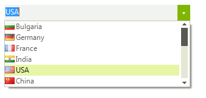
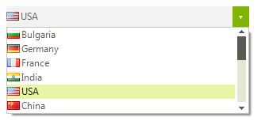
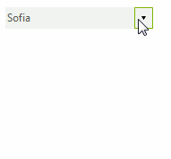

# DropDownStyle

The __RadDropDownList.DropDownStyle__ property determines if the text area at the top of the control can be edited. A setting of *DropDown* (the default) allows editing and the *DropDownList* setting shows the text area as read-only.
         
>caption Figure 1: DropDown

>caption Figure 2: DropDownList

#### Setting DropDownStyle 

<snippet id='dropdownlist-dropdownstyle-dropdownstyle-cs' />
<snippet id='dropdownlist-dropdownstyle-dropdownstyle-vb' />

When __RadDropDownList__ is set to *RadDropDownStyle.DropDownList* one can control if an image will be displayed in the editor:         

#### Image in Editor 

<snippet id='dropdownlist-dropdownstyle-imageineditor-cs' />
<snippet id='dropdownlist-dropdownstyle-imageineditor-vb' />

## User Defined Values

This section describes how user defined values can be added to the data source populating the items in __RadDropDownList__. For the purpose we are going to bind the control to a BindingList instance and add the newly created item if the Enter key has been pressed.
        
>caption Figure 3: Adding User Defined Values

#### Initial Set Up 

<snippet id='dropdownlist-dropdownstyle-initialsetup-cs' />
<snippet id='dropdownlist-dropdownstyle-initialsetup-vb' />

Now we need to handle the event, perform the required checks and update our data source.

#### Initial Set Up 

<snippet id='dropdownlist-dropdownstyle-handleevent-cs' />
<snippet id='dropdownlist-dropdownstyle-handleevent-vb' />

# See Also
* [Indicating Focus in RadDropDownList]()

