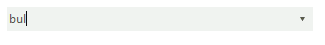
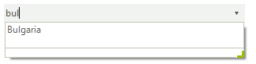
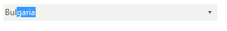
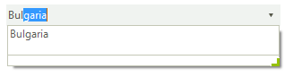
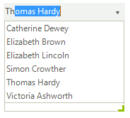
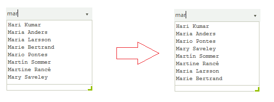

# Auto-complete
 
__RadDropDownList__ provides flexible auto-completion options that suggest and  append text from choices in the list as the user types. 
      

## AutoCompleteMode

The RadDropDownList.__AutoCompleteMode__ property controls auto-complete behavior and can be set to *None, Suggest, Append* and *SuggestAppend*:
         
>note All auto-complete modes depend on the value of the Boolean __CaseSensitive__ property.
>

* __None__: Nothing happens when a user begins to type into the text box part of the control. If the user types the whole text of an item and presses Enter, the item is selected. 

>caption Figure 1: AutoCompleteMode.None 
 

#### AutoCompleteMode.None 

<snippet id='dropdownlist-auto-complete-autocnone-cs' />
<snippet id='dropdownlist-auto-complete-autocnone-vb' />

 
* __Suggest__: As the user types an entry into the text box, the drop-down part of the control is shown, and the displayed items are filtered according to the entered text.

#### AutoCompleteMode.Suggest 

<snippet id='dropdownlist-auto-complete-autocsuggest-cs' />
<snippet id='dropdownlist-auto-complete-autocsuggest-vb' />

>caption Figure 2: AutoCompleteMode.Suggest 

 
* __Append__: As the user types, the next item in the list that matches the user input is automatically appended to the characters the user has already typed. The drop-down list is not shown without the user clicking the arrow.

>caption Figure 3: AutoCompleteMode.Append 

#### AutoCompleteMode.Append 

<snippet id='dropdownlist-auto-complete-autocappend-cs' />
<snippet id='dropdownlist-auto-complete-autocappend-vb' />

 
* __SuggestAppend__: Similar to the Append setting, but the drop-down list is shown and the suggested item is highlighted.

#### AutoCompleteMode.SuggestAppend 

<snippet id='dropdownlist-auto-complete-autocsuggestappend-cs' />
<snippet id='dropdownlist-auto-complete-autocsuggestappend-vb' />

>caption Figure 4: AutoCompleteMode.SuggestAppend

 
## Auto-Complete Helpers

__RadDropDownList__ internally uses auto-complete helpers to perform the auto-complete functionality.

\* __AutoCompleteSuggestHelper__: it is created when the __AutoCompleteMode__ property is set to AutoCompleteMode.*Suggest* or AutoCompleteMode.*SuggestAppend*. You can find below the __AutoCompleteSuggestHelper__'s properties:
            

* __SuggestMode__: determines whether the items are auto-completed considering whether the text starts with or contains the searched text.
                
#### SuggestMode.Contains 

<snippet id='dropdownlist-auto-complete-autocsuggestmode-cs' />
<snippet id='dropdownlist-auto-complete-autocsuggestmode-vb' />

>caption Figure 5: SuggestMode.Contains

 

* __AutoCompleteDataSource__: specifies the data structure to be bound.
                

* __AutoCompleteDisplayMember__: specifies the particular field in the data source which will be used from the items in __AutoCompleteSuggestHelper__  for their Text.
                

\* __AutoCompleteAppendHelper__:  it is created when the __AutoCompleteMode__ property is set to AutoCompleteMode.*Append* or AutoCompleteMode.*SuggestAppend*. The __LimitToList__ property controls whether the user is blocked to enter invalid string in the editable part.

#### Limit the user to enter only valid values 

<snippet id='dropdownlist-auto-complete-autoclimittolist-cs' />
<snippet id='dropdownlist-auto-complete-autoclimittolist-vb' />

 
## Customize auto-complete helpers

By default, the items displayed in the __AutoCompleteSuggestHelper__’s pop-up are sorted alphabetically. The following example demonstrates how to manipulate the sort order considering the item’s Text.__Length__ property:

#### Custom comparer 

<snippet id='dropdownlist-auto-complete-customcomparer-cs' />
<snippet id='dropdownlist-auto-complete-customcomparer-vb' />

>caption Figure 6: Custom comparer

