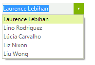
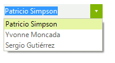

# Filtering

__RadDropDownList__ supports filtering of its items. In order to apply a filter, you should set the __Filter__ property of __RadDropDownList__ to a predicate that will be called for every data item in order to determine if the item will be visible.

#### Filter 

<snippet id='dropdownlist-filtering-filter-cs' />
<snippet id='dropdownlist-filtering-filter-vb' />

 

#### Filtering predicate 

<snippet id='dropdownlist-filtering-filteringpredicate-cs' />
<snippet id='dropdownlist-filtering-filteringpredicate-vb' />

 
 

If you apply the above filter to a __RadDropDownList__ that is bound to the Northwind.__Customers__ table you will obtain the following result:
        
>caption Figure 1: Filter

Another option to filter the items is to specify the __FilterExpression__ property.

#### FilteringExpression 

<snippet id='dropdownlist-filtering-filteringexpression-cs' />
<snippet id='dropdownlist-filtering-filteringexpression-vb' />

 
 
>caption Figure 2: FilteringExpression

>note The __IsFilterActive__ property gets a value indicating whether there is a __Filter__ or __FilterExpression__ set.
>

