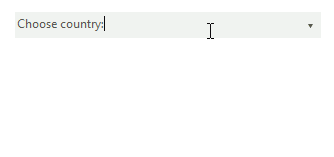
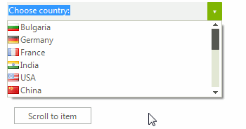
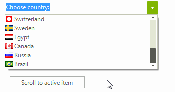
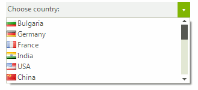
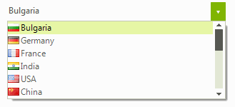
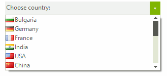

# Scrolling
 
If the __RadListDataItems__ cannot fit in the popup a vertical scroll bar appears so that they can be scrolled and later selected. By default, the value of the __EnableMouseWheel__ is set to *true* enabling scrolling through the items by using the mouse wheel.
      
## KineticScrolling

This feature ensures that the control is ready for modern touch-screen applications. It can be attached by simply setting the __EnableKineticScrolling__ to *true*.
        
>caption Figure 1: Enable Kinetic Scrolling

#### Enabling Kinetic Scrolling 

<snippet id='dropdownlist-scrolling-kineticscrolling-cs' />
<snippet id='dropdownlist-scrolling-kineticscrolling-vb' />

 

## Programmatically Scrolling

__RadDropDownList__ provides out of the box functionality for programmatically scrolling its content. The available methods are: 
        

* __ScrollToItem__: Scrolls to a specific item.
            

* __ScrollToActiveItem__: Scrolls to the active item if it is not null and if it is not fully visible.
            
>caption Figure 2: Scroll to Item

#### Scroll to Item 

<snippet id='dropdownlist-scrolling-scrolltoitem-cs' />
<snippet id='dropdownlist-scrolling-scrolltoitem-vb' />

 
 

>caption Figure 3: Scroll to Active Item

#### Scroll to Active Item 

<snippet id='dropdownlist-scrolling-scrolltoactiveitem-cs' />
<snippet id='dropdownlist-scrolling-scrolltoactiveitem-vb' />

 
 

## Scrolling Modes

The __ListElement__ contained in the popup of __RadDropDownList__ supports three types of __ScrollModes__:
        

* __Discrete__: Defines scrolling by only one item at a time.
            

* __Smooth__: Sets scrolling by pixel, meaning that an item can be partially visible.
            

* __Deferred__: Does not cause GUI updates until the user finishes the scrolling operation.
            
>caption Figure 4: Discrete Scrolling

#### Discrete Scrolling 

<snippet id='dropdownlist-scrolling-discretescrolling-cs' />
<snippet id='dropdownlist-scrolling-discretescrolling-vb' />

 

>caption Figure 5: Smooth Scrolling

#### Smooth Scrolling 

<snippet id='dropdownlist-scrolling-smoothscrolling-cs' />
<snippet id='dropdownlist-scrolling-smoothscrolling-vb' />

 
 
>caption Figure 6: Deferred Scrolling

#### Deferred Scrolling 

<snippet id='dropdownlist-scrolling-deferredscrolling-cs' />
<snippet id='dropdownlist-scrolling-deferredscrolling-vb' />

 

