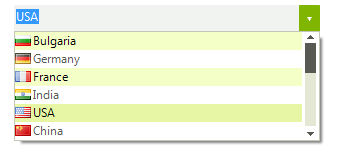
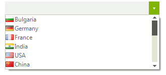

# Selection
 
## Selection Mode

__RadDropDownList__ supports three types of selection modes:
        

* __One__: Only one item can be selected.
            

* __MultiSimple__: Multiple items can be selected.
            

* __MultiExtended__: Multiple selection which can also be performed by using the Ctrl, Shift and arrow keys.
            
>caption Figure 1: MutiExtended Selection Mode



#### Setting a Selection Mode 

{{source=..\SamplesCS\DropDownListControl\DropDownList\DropDownListSelection.cs region=MultiExtendedSelection}} 
{{source=..\SamplesVB\DropDownListControl\DropDownList\DropDownListSelection.vb region=MultiExtendedSelection}} 

````C#
this.radDropDownList1.DropDownListElement.SelectionMode = SelectionMode.MultiExtended;

````
````VB.NET
Me.radDropDownList1.DropDownListElement.SelectionMode = SelectionMode.MultiExtended

````

{{endregion}} 
 

## Select Next Item

__RadDropDownList__ can automatically select the next item when a double click in the edit box is performed.
>caption Figure 2: Select Next Item



#### Next Item Selection 

{{source=..\SamplesCS\DropDownListControl\DropDownList\DropDownListSelection.cs region=NextItemSelection}} 
{{source=..\SamplesVB\DropDownListControl\DropDownList\DropDownListSelection.vb region=NextItemSelection}} 

````C#
this.radDropDownList1.SelectNextOnDoubleClick = true;

````
````VB.NET
Me.radDropDownList1.SelectNextOnDoubleClick = True

````

{{endregion}} 
 

## Selection Events

There are couple of events to which you can subscribe your __RadDropDownList__ and retrieve information about the selected value or index:
        

* __SelectedIndexChanging__: Raised before the index actually changes, the handler is a suitable place to cancel the operation if the application logic requires it.
            

* __SelectedIndexChanged__: Raised after the index had been changed, the event arguments provide information about the new position of the selected item.
            

* __SelectedValueChanged__: Raised if __RadDropDownList.SelectedValue__ has been changed.
            

## Programmatically Select Items

Items can be programmatically selected either by their value or by their logical representation, the __RadListDataItem__. The responsible properties can be directly accessed from the __RadDropDownList__ object:
        

* __SelectedValue__: Defines the currently selected value, its type needs to be the same as the type of the elements which populate the __RadDropDownList__.
            

* __SelectedItem__: This is the logical representation of the selected value, its type is __RadListDataItem__.
            

* __SelectedIndex__: Selects an item according to its index in the __Items__ collection.
            

* __SelectedItems__: Returns a collection of the currently selected items
            

>note Setting these properties will result in raising the selection events.
>

{{source=..\SamplesCS\DropDownListControl\DropDownList\DropDownListSelection.cs region=SetSelectedItem}} 
{{source=..\SamplesVB\DropDownListControl\DropDownList\DropDownListSelection.vb region=SetSelectedItem}} 

````C#

this.radDropDownList1.SelectedItem = this.radDropDownList1.Items[1];

````
````VB.NET

Me.radDropDownList1.SelectedItem = Me.radDropDownList1.Items(1)

````

{{endregion}} 


