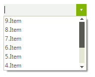
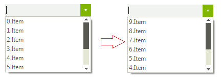

# Sorting
 
## SortStyle

__RadDropDownList__ supports sorting of its pop-up items. You can control how the items in the __RadDropDownList__ are sorted by specifying the __SortStyle__ property.

* __Ascending__: indicates ascending sorting.
            

* __Descending__: indicates descending sorting.
            

* __None__: indicates no sorting. Items appear in the order of inserting.
            
>caption Figure 1: SortStyle.Descending

#### SortStyle 

<snippet id='dropdownlist-sorting-sortstyle-cs' />
<snippet id='dropdownlist-sorting-sortstyle-vb' />

 
 

## Customizing sort order

When the __SortStyle__ property is set to *Ascending* or *Descending* you can manipulate how the items are ordered by specifying the __ItemsSortComparer__ property. You should create a class that implements the __IComparer&lt;RadListDataItem&gt;__ interface. The following example demonstrates how to order the items considering the RadListDataItem.__Value__ property instead of the RadListDataItem.__Text__ property:
        
>caption Figure 2: Custom sort order

#### Custom comparer 

<snippet id='dropdownlist-sorting-customcomparer-cs' />
<snippet id='dropdownlist-sorting-customcomparer-vb' />

 

