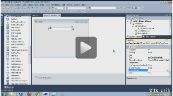
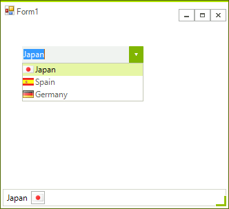
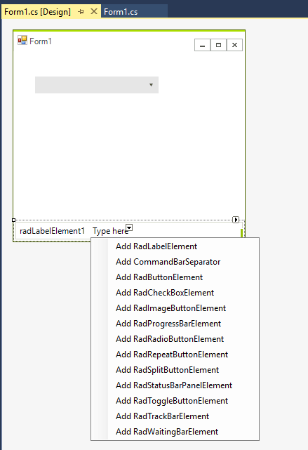

# Getting Started
 
| RELATED VIDEOS |  |
| ------ | ------ |
|[Getting Started with RadDropDownList](http://tv.telerik.com/watch/winforms/getting-started-with-raddropdownlist)
In this video, you will learn how to bind data to the new RadDropDownList control.||

## 

The following tutorial demonstrates how to add items and images to a __RadDropDownList__ and how to retrieve selected text and images.

>caption Figure 1: Select a country from RadDropDownList



1. Add a __RadDropDownList__ and a __RadStatusStrip__ to a form. 

1. Add a few images to the project as resources.

1. Using the downward arrow of the __RadStatusStrip__, add a __RadLabelElement__ and a  __RadButtonElement__. Set the __DisplayStyle__ of the RadButtonElement to *Image*.
            
	>caption Figure 2: RadStatusStrip item elements

	

1. Select __RadDropDownList__ and find the __Items__ property in the Property Window of Visual Studio. Click the  ellipsis button to open the *RadItem Collection Editor*. Click the `Add` button three times to create three list items. Set the text of the first, second and third item to *Japan*, *Spain* and  *Germany* respectively. Set the resource images to the __Image__ property of the items. In addition, set the __TextImageRelation__ property to *ImageBeforeText*. 

1. Click __OK__ to close the __RadItem Collection Editor__. 

1. In the __Properties Window__ select the __Events__ button. 

1. Locate and double-click the __RadDropDownList__ __SelectedIndexChanged__ event to create an event handler. 

1. Paste the following code to the __SelectedIndexChanged__ event handler. The code retrieves the selected item and  assigns the text and image for the selected item to the status bar label and image elements.

#### Handling the SelectedIndexChanged event 

{{source=..\SamplesCS\DropDownListControl\DropDownList\DropDownList1.cs region=handlingSelectedIndexChanged}} 
{{source=..\SamplesVB\DropDownListControl\DropDownList\DropDownList1.vb region=handlingSelectedIndexChanged}} 

````C#
    
void radDropDownList1_SelectedIndexChanged(object sender, Telerik.WinControls.UI.Data.PositionChangedEventArgs e)
{
    if (this.radDropDownList1.SelectedIndex > -1)
    {
        this.radLabelElement1.Text = this.radDropDownList1.SelectedItem.Text;
        this.radImageButtonElement1.Image = this.radDropDownList1.SelectedItem.Image;
    }
}

````
````VB.NET
Private Sub radDropDownList1_SelectedIndexChanged(ByVal sender As Object, ByVal e As Telerik.WinControls.UI.Data.PositionChangedEventArgs)
    If Me.radDropDownList1.SelectedIndex > -1 Then
        radLabelElement1.Text = Me.radDropDownList1.SelectedItem.Text
        Me.radImageButtonElement1.Image = Me.radDropDownList1.SelectedItem.Image
    End If
End Sub

````

{{endregion}} 
 
This is it! Now the change in the selection of the __RadDropDownList__ instance will be reflected on __RadStatusStrip__.

## Telerik UI for WinForms Learning Resources
* [Telerik UI for WinForms DropDownList Component](https://www.telerik.com/products/winforms/dropdownlist.aspx)
* [Getting Started with Telerik UI for WinForms Components](https://docs.telerik.com/devtools/winforms/getting-started/first-steps)
* [Telerik UI for WinForms Setup](https://docs.telerik.com/devtools/winforms/installation-and-upgrades/installing-on-your-computer)
* [Telerik UI for WinForms Application Modernization](https://docs.telerik.com/devtools/winforms/winforms-converter/overview)
* [Telerik UI for WinForms Visual Studio Templates](https://docs.telerik.com/devtools/winforms/visual-studio-integration/visual-studio-templates)
* [Deploy Telerik UI for WinForms Applications](https://docs.telerik.com/devtools/winforms/deployment-and-distribution/application-deployment)
* [Telerik UI for WinForms Virtual Classroom(Training Courses for Registered Users)](https://learn.telerik.com/learn/course/external/view/elearning/17/telerik-ui-for-winforms)
* [Telerik UI for WinForms License Agreement)](https://www.telerik.com/purchase/license-agreement/winforms-dlw-s)

