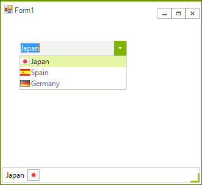
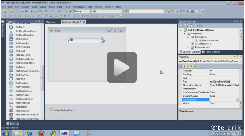
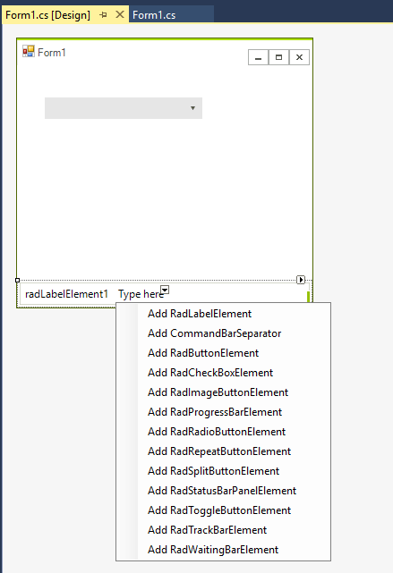

# Getting Started with WinForms DropDownList

Use `RadDropDownList` to display a compact list of choices in a WinForms application. This getting-started guide shows how to add the control, populate it with text and images, and react when the selected item changes.

## What You Will Build

In this example, users select a country from `RadDropDownList`, and the selected text and image are displayed in `RadStatusStrip`.

**Completed example with a country selector and status strip.**

## Watch the Video Tutorial

If you prefer a guided walkthrough, watch [Getting Started with RadDropDownList](http://tv.telerik.com/watch/winforms/getting-started-with-raddropdownlist). The video demonstrates the same basic setup and data-binding workflow.

**Video tutorial preview for the RadDropDownList getting-started walkthrough.**

## Install the Required Assemblies

Choose the setup approach that matches your project.

### Install with NuGet

To use `RadDropDownList` with NuGet packages, install `Telerik.UI.for.WinForms.AllControls`. If your project targets a specific framework, review the [available Telerik UI for WinForms NuGet packages]() before you install.

For the full NuGet workflow, see [Install Telerik UI for WinForms by using NuGet packages]().

>tip
>
> Starting with the 2025 Q1 release, Telerik UI for WinForms uses a new licensing mechanism. For details, see [Set up your Telerik license key]().

### Add Assembly References Manually

When you drag a control from the Visual Studio Toolbox to the Form Designer, Visual Studio adds the required references automatically. If you create `RadDropDownList` in code, add these assemblies manually:

* `Telerik.Licensing.Runtime`
* `Telerik.WinControls`
* `Telerik.WinControls.UI`
* `TelerikCommon`

If you still need to install the assemblies locally, review the available [Telerik UI for WinForms installation approaches]().

## Create the DropDownList Example

Follow these steps to build the sample form:

1. Add a `RadDropDownList` and a `RadStatusStrip` to the form.
2. Add a few images to the project resources. In this example, each image represents one country in the list.
3. Open the `RadStatusStrip` smart tag, add a `RadLabelElement` and a `RadButtonElement`, and set the `DisplayStyle` property of the `RadButtonElement` to `Image`.

**Status strip configured with label and button elements.**

4. Select `RadDropDownList`, find the `Items` property in the **Properties Window**, and click the ellipsis button to open the **RadItem Collection Editor**.
5. Click **Add** three times to create three items.
6. Set the item text to `Japan`, `Spain`, and `Germany`.
7. Assign the matching resource image to each item's `Image` property.
8. Set `TextImageRelation` to `ImageBeforeText` for each item so the image appears before the text.
9. Click **OK** to close the **RadItem Collection Editor**.
10. In the **Properties Window**, select the **Events** button.
11. Locate the `SelectedIndexChanged` event for `RadDropDownList` and double-click it to generate an event handler.

## Handle Selection Changes

Add the following event handler code to update the status strip whenever the selected item changes:

### Handle the SelectedIndexChanged Event

<snippet id='dropdownlist-getting-started-handlingselectedindexchanged-cs' />
<snippet id='dropdownlist-getting-started-handlingselectedindexchanged-vb' />

This code reads the selected `RadListDataItem` and assigns its text and image to the `RadStatusStrip` elements. When users choose a different country, the status strip updates immediately.

## Result

After you complete these steps, `RadDropDownList` displays the country list with images, and `RadStatusStrip` reflects the current selection. This pattern is useful when the selected value needs to update other parts of the UI without opening another dialog.

## Telerik UI for WinForms Learning Resources

Continue with these related resources:

* [Telerik UI for WinForms DropDownList component](https://www.telerik.com/products/winforms/dropdown-and-list.aspx)
* [Getting started with Telerik UI for WinForms components](https://docs.telerik.com/devtools/winforms/getting-started/first-steps)
* [Telerik UI for WinForms setup](https://docs.telerik.com/devtools/winforms/installation-and-upgrades/installing-on-your-computer)
* [Telerik UI for WinForms Converter](https://www.telerik.com/products/winforms/documentation/ai-coding-assistant/converter/converter)
* [Telerik UI for WinForms Visual Studio templates](https://docs.telerik.com/devtools/winforms/visual-studio-integration/visual-studio-templates)
* [Deploy Telerik UI for WinForms applications](https://docs.telerik.com/devtools/winforms/deployment-and-distribution/application-deployment)
* [Telerik UI for WinForms virtual classroom training courses for registered users](https://learn.telerik.com/learn/course/external/view/elearning/17/telerik-ui-for-winforms)
* [Telerik UI for WinForms license agreement](https://www.telerik.com/purchase/license-agreement/winforms-dlw-s)

