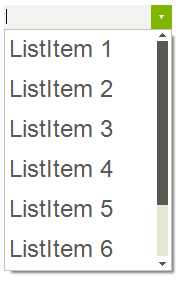
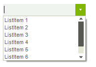
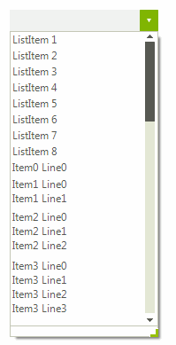
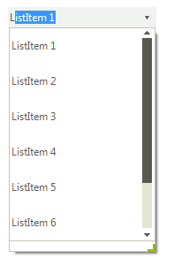

# Item Sizing
 
## ItemHeight

By default, all items in __RadDropDownList__ have equal height, *18px*. You can set the ListElement.__ItemHeight__  property in order to specify the desired height for all items.

>caption Figure 1: ItemHeight



#### ItemHeight 

{{source=..\SamplesCS\DropDownListControl\DropDownList\DropDownListItemSizing.cs region=ItemHeight}} 
{{source=..\SamplesVB\DropDownListControl\DropDownList\DropDownListItemSizing.vb region=ItemHeight}} 

````C#
            
this.radDropDownList1.DropDownListElement.ListElement.Font = new Font("Arial", 18f);
this.radDropDownList1.ListElement.ItemHeight = 40;

````
````VB.NET
Me.RadDropDownList1.DropDownListElement.ListElement.Font = New Font("Arial", 18.0F)
Me.RadDropDownList1.ListElement.ItemHeight = 40

````

{{endregion}} 
 

## AutoSizeItems

The RadDropDownList.__AutoSizeItems__ property indicates whether items will be sized according to their content.       
      
>caption Figure 2: AutoSizeItems



#### AutoSizeItems 

{{source=..\SamplesCS\DropDownListControl\DropDownList\DropDownListItemSizing.cs region=AutoSizeItems}} 
{{source=..\SamplesVB\DropDownListControl\DropDownList\DropDownListItemSizing.vb region=AutoSizeItems}} 

````C#
this.radDropDownList1.DropDownListElement.ListElement.Font = new Font("Arial", 8f);
this.radDropDownList1.AutoSizeItems = true;

````
````VB.NET
Me.RadDropDownList1.DropDownListElement.ListElement.Font = New Font("Arial", 8.0F)
Me.RadDropDownList1.AutoSizeItems = True

````

{{endregion}} 

 
If this property is set to *false* the user can set the __Height__ property of each individual __RadListDataItem__ in the __Items__ collection in order to override the automatic sizing.
        
>caption Figure 3: Custom height for each item



#### Height 

{{source=..\SamplesCS\DropDownListControl\DropDownList\DropDownListItemSizing.cs region=Height}} 
{{source=..\SamplesVB\DropDownListControl\DropDownList\DropDownListItemSizing.vb region=Height}} 

````C#
            
this.radDropDownList1.AutoSizeItems = false;
StringBuilder sb;
for (int i = 0; i < 10; i++)
{
    RadListDataItem item = new RadListDataItem();
    sb = new StringBuilder();
    for (int j = 0; j < i + 1; j++)
    {
        sb.AppendLine("Item" + i + " Line" + j);
    }
    item.Text = sb.ToString();
    item.Height = this.radDropDownList1.ListElement.ItemHeight * (i + 1);
    this.radDropDownList1.Items.Add(item);
}

````
````VB.NET
Me.RadDropDownList1.AutoSizeItems = False
Dim sb As StringBuilder
For i As Integer = 0 To 9
    Dim item As New RadListDataItem()
    sb = New StringBuilder()
    For j As Integer = 0 To i
        sb.AppendLine("Item" & i & " Line" & j)
    Next
    item.Text = sb.ToString()
    item.Height = Me.RadDropDownList1.ListElement.ItemHeight * (i + 1)
    Me.RadDropDownList1.Items.Add(item)
Next

````

{{endregion}} 
 
## Sizing auto-complete pop-up items

When the RadDropDownList.__AutoCompleteMode__ property is set to *Suggest* or *SuggestAppend* you can customize the height of the auto-complete items by setting the DropDownListElement.AutoCompleteSuggest.DropDownList.ListElement.__ItemHeight__ property:
        
>caption Figure 4: AutoCompleteSuggest.DropDownList.ListElement.ItemHeight



#### Auto-complete items height 

{{source=..\SamplesCS\DropDownListControl\DropDownList\DropDownListItemSizing.cs region=AutoCompleteItemsHeight}} 
{{source=..\SamplesVB\DropDownListControl\DropDownList\DropDownListItemSizing.vb region=AutoCompleteItemsHeight}} 

````C#
this.radDropDownList1.AutoCompleteMode = AutoCompleteMode.SuggestAppend;
this.radDropDownList1.DropDownListElement.AutoCompleteSuggest.DropDownList.ListElement.ItemHeight = 40;

````
````VB.NET
Me.RadDropDownList1.AutoCompleteMode = AutoCompleteMode.SuggestAppend
Me.RadDropDownList1.DropDownListElement.AutoCompleteSuggest.DropDownList.ListElement.ItemHeight = 40

````

{{endregion}} 


