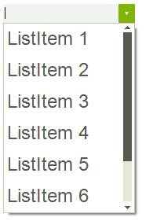
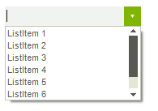
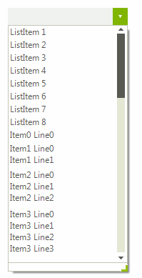
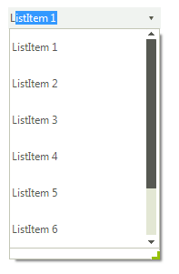

# Item Sizing
 
## ItemHeight

By default, all items in __RadDropDownList__ have equal height, *18px*. You can set the ListElement.__ItemHeight__  property in order to specify the desired height for all items.

>caption Figure 1: ItemHeight

#### ItemHeight 

<snippet id='dropdownlist-item-sizing-itemheight-cs' />
<snippet id='dropdownlist-item-sizing-itemheight-vb' />

 

## AutoSizeItems

The RadDropDownList.__AutoSizeItems__ property indicates whether items will be sized according to their content.       
      
>caption Figure 2: AutoSizeItems

#### AutoSizeItems 

<snippet id='dropdownlist-item-sizing-autosizeitems-cs' />
<snippet id='dropdownlist-item-sizing-autosizeitems-vb' />

 
If this property is set to *false* the user can set the __Height__ property of each individual __RadListDataItem__ in the __Items__ collection in order to override the automatic sizing.
        
>caption Figure 3: Custom height for each item

#### Height 

<snippet id='dropdownlist-item-sizing-height-cs' />
<snippet id='dropdownlist-item-sizing-height-vb' />

 
## Sizing auto-complete pop-up items

When the RadDropDownList.__AutoCompleteMode__ property is set to *Suggest* or *SuggestAppend* you can customize the height of the auto-complete items by setting the DropDownListElement.AutoCompleteSuggest.DropDownList.ListElement.__ItemHeight__ property:
        
>caption Figure 4: AutoCompleteSuggest.DropDownList.ListElement.ItemHeight

#### Auto-complete items height 

<snippet id='dropdownlist-item-sizing-autocompleteitemsheight-cs' />
<snippet id='dropdownlist-item-sizing-autocompleteitemsheight-vb' />

