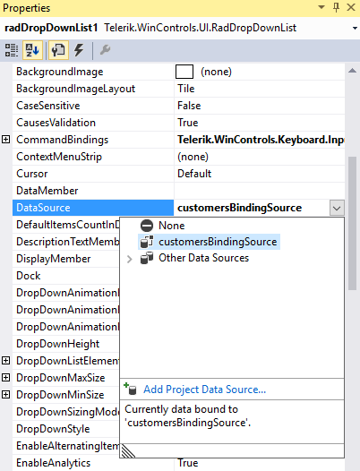
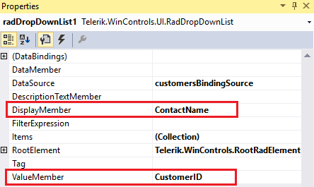
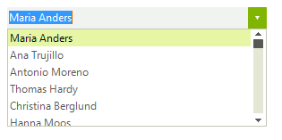
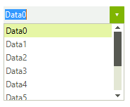

# Data binding
 
Data binding is a mechanism for automatic population of the __RadDropDownList__ with items, based on the provided data structure. Three properties control the data binding:

* __DataSource__ - specifies the data structure to be bound.
          

* __DisplayMember__ - specifies the particular field in the data source which will be used from the items in __RadDropDownList__ for their Text.
          

* __ValueMember__ - specifies the particular field in the data source which will be stored in the items Value property.
          
__RadDropDownList__ supports data binding either at design time or at run time:

## Data binding at design time

You can set the __DataSource__ property at design time in the *Properties* window of Visual Studio.

1. Select the __DataSource__ property and click the drop-down arrow to display all existing data sources on the form. 

1. Click the *Add Project Data Source…* link and follow the instructions in the *Data Source Configuration Wizard*  to add a data source to your project. You can use a single database table. 

	>caption Figure: 1 Setting the DataSource at Design time

	

1. Afterwards, you need to specify the __DisplayMember__ and __ValueMember__ properties.

	>caption Figure: 2 Setting the DisplayMember and ValueMember properties at Design time

	

	>caption Figure: 3 RadDropDownList bound at Design time

	

## Data binding at run time

You can bind __RadDropDownList__ programmatically as well. The following code snippet demonstrates how to bind it to a collection of custom objects:

#### Data binding at run time 

{{source=..\SamplesCS\DropDownListControl\DropDownList\DropDownList1.cs region=Binding}} 
{{source=..\SamplesVB\DropDownListControl\DropDownList\DropDownList1.vb region=Binding}} 

````C#
    
public class Item
{
    public int Id { get; set; }
    
    public string Description { get; set; }
        
    public Item(int id, string description)
    {
        this.Id = id;
        this.Description = description;
    }
}
    
public void Bind()
{
    List<Item> items = new List<Item>();
    for (int i = 0; i < 10; i++)
    {
        items.Add(new Item(i,"Data" + i));
    }
    this.radDropDownList1.DataSource = items;
    this.radDropDownList1.DisplayMember = "Description";
    this.radDropDownList1.ValueMember = "Id";
}

````
````VB.NET
Public Class Item
    Public Property Id() As Integer
        Get
            Return m_Id
        End Get
        Set(value As Integer)
            m_Id = value
        End Set
    End Property
    Private m_Id As Integer
    Public Property Description() As String
        Get
            Return m_Description
        End Get
        Set(value As String)
            m_Description = value
        End Set
    End Property
    Private m_Description As String
    Public Sub New(id As Integer, description As String)
        Me.Id = id
        Me.Description = description
    End Sub
End Class
Public Sub Bind()
    Dim items As New List(Of Item)()
    For i As Integer = 0 To 9
        items.Add(New Item(i, "Data" + i))
    Next
    Me.radDropDownList1.DataSource = items
    Me.radDropDownList1.DisplayMember = "Description"
    Me.radDropDownList1.ValueMember = "Id"
End Sub

````

{{endregion}} 
 
>caption Figure: 4 RadDropDownList bound at Run time



# See Also

* [Design Time]()
* [Adding Items Programmatically]()