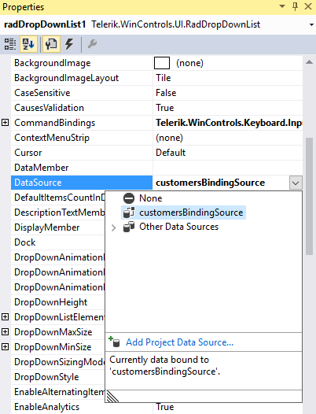
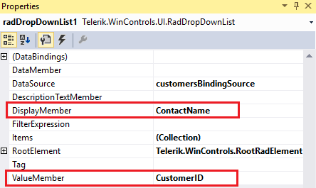
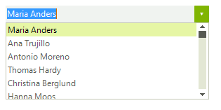
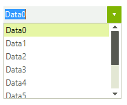

# Data binding
 
Data binding is a mechanism for automatic population of the __RadDropDownList__ with items, based on the provided data structure. Three properties control the data binding:

* __DataSource__ - specifies the data structure to be bound.
          

* __DisplayMember__ - specifies the particular field in the data source which will be used from the items in __RadDropDownList__ for their Text.
          

* __ValueMember__ - specifies the particular field in the data source which will be stored in the items Value property.
          
__RadDropDownList__ supports data binding either at design time or at run time:

## Data binding at design time

You can set the __DataSource__ property at design time in the *Properties* window of Visual Studio.

1. Select the __DataSource__ property and click the drop-down arrow to display all existing data sources on the form. 

1. Click the *Add Project Data Source…* link and follow the instructions in the *Data Source Configuration Wizard*  to add a data source to your project. You can use a single database table. 

	>caption Figure: 1 Setting the DataSource at Design time

	

1. Afterwards, you need to specify the __DisplayMember__ and __ValueMember__ properties.

	>caption Figure: 2 Setting the DisplayMember and ValueMember properties at Design time

	

	>caption Figure: 3 RadDropDownList bound at Design time

	

## Data binding at run time

You can bind __RadDropDownList__ programmatically as well. The following code snippet demonstrates how to bind it to a collection of custom objects:

#### Data binding at run time 

<snippet id='dropdownlist-data-binding-binding-cs' />
<snippet id='dropdownlist-data-binding-binding-vb' />

 
 
>caption Figure: 4 RadDropDownList bound at Run time

# See Also

* [Design Time]()
* [Adding Items Programmatically]()
* [How to Include Multiple Fields in the RadDropDownList's DisplayMember ]()
