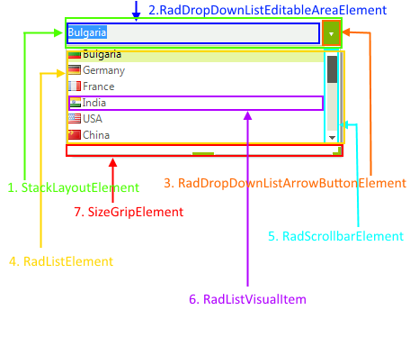

# Structure

This article describes the inner structure and organization of the elements which build the __RadDropDownList__ control.
        
>caption Figure 1: RadDropDownList visual structure

1. __StackLayoutElement__: Serves as a container element defining a stack layout.
            

1. __RadDropDownListEditableAreaElement__: Contains a __RadDropDownTextBoxElement__ responsible for handling user input.
            

1. __RadDropDownListArrowButtonElement__: Expands the __RadListElement__.
            

1. __RadListElement__: Parent element containing the populated items and the scroll bar.
            

1. __RadScrollbarElement__: Scrolls through the items.
            

1. __RadListVisualItem__: Visual representation of the populated __RadListDataItem__.
            

1. __SizeGripElement__: Resizes the drop down element.

# See Also

* [RadControlSpy]()
            
