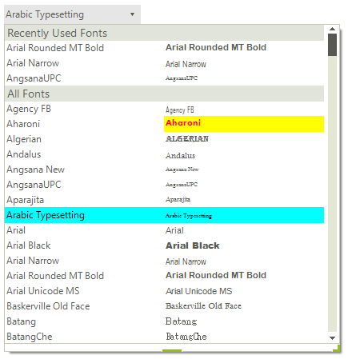

# Formatting Items
 
Since **RadFontDropDownList** internally uses a **RadListView** in *DetailsView*, it is possible to customize each cell element, using the [CellFormatting]() event.

You can access the hosted **RadListView** control by the RadFontDropDownList.**FontListView** property and subscribe to its **CellFormatting** event in order to customize cell elements:



#### Formatting the cell elements

{{source=..\SamplesCS\Editors\FontDropDownList.cs region=ItemsFormatting}} 
{{source=..\SamplesVB\Editors\FontDropDownList.vb region=ItemsFormatting}} 

````C#
private void FontListView_CellFormatting(object sender, Telerik.WinControls.UI.ListViewCellFormattingEventArgs e)
{
    DetailListViewDataCellElement cell = e.CellElement as DetailListViewDataCellElement;
    if (cell == null)
    {
        return;
    }
    if (e.CellElement.Data.Name == "Preview" && e.CellElement.Text == "Aharoni")
    {
        e.CellElement.BackColor = Color.Yellow;
        e.CellElement.ForeColor = Color.Red;
        e.CellElement.GradientStyle = Telerik.WinControls.GradientStyles.Solid;
    }
    else if (cell.Row.Selected)
    {
        e.CellElement.BackColor = Color.Aqua;
        e.CellElement.ForeColor = Color.Black;
        e.CellElement.GradientStyle = Telerik.WinControls.GradientStyles.Solid;
    }
    else
    {
        e.CellElement.ResetValue(LightVisualElement.BackColorProperty, Telerik.WinControls.ValueResetFlags.Local);
        e.CellElement.ResetValue(LightVisualElement.ForeColorProperty, Telerik.WinControls.ValueResetFlags.Local);
        e.CellElement.ResetValue(LightVisualElement.GradientStyleProperty, Telerik.WinControls.ValueResetFlags.Local);
    }
}

````
````VB.NET
Private Sub FontListView_CellFormatting(sender As Object, e As UI.ListViewCellFormattingEventArgs)
    Dim cell As DetailListViewDataCellElement = TryCast(e.CellElement, DetailListViewDataCellElement)
    If cell Is Nothing Then
        Return
    End If
    If e.CellElement.Data.Name = "Preview" AndAlso e.CellElement.Text = "Aharoni" Then
        e.CellElement.BackColor = Color.Yellow
        e.CellElement.ForeColor = Color.Red
        e.CellElement.GradientStyle = Telerik.WinControls.GradientStyles.Solid
    ElseIf cell.Row.Selected Then
        e.CellElement.BackColor = Color.Aqua
        e.CellElement.ForeColor = Color.Black
        e.CellElement.GradientStyle = Telerik.WinControls.GradientStyles.Solid
    Else
        e.CellElement.ResetValue(LightVisualElement.BackColorProperty, Telerik.WinControls.ValueResetFlags.Local)
        e.CellElement.ResetValue(LightVisualElement.ForeColorProperty, Telerik.WinControls.ValueResetFlags.Local)
        e.CellElement.ResetValue(LightVisualElement.GradientStyleProperty, Telerik.WinControls.ValueResetFlags.Local)
    End If
End Sub

````

{{endregion}} 
