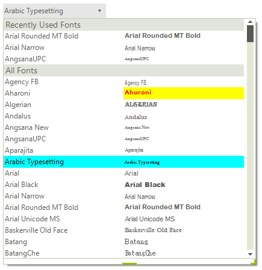

# Formatting Items
 
Since **RadFontDropDownList** internally uses a **RadListView** in *DetailsView*, it is possible to customize each cell element, using the [CellFormatting]() event.

You can access the hosted **RadListView** control by the RadFontDropDownList.**FontListView** property and subscribe to its **CellFormatting** event in order to customize cell elements:

#### Formatting the cell elements

<snippet id='fontdropdownlist-formatting-items-itemsformatting-cs' />
<snippet id='fontdropdownlist-formatting-items-itemsformatting-vb' />

 
