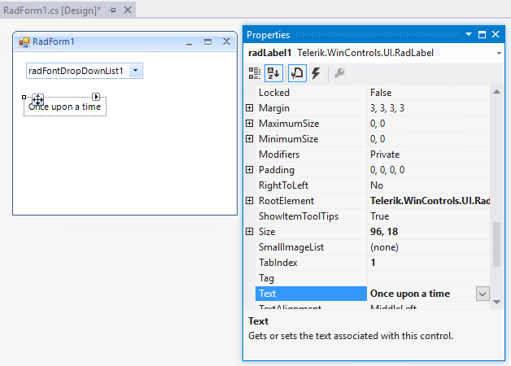
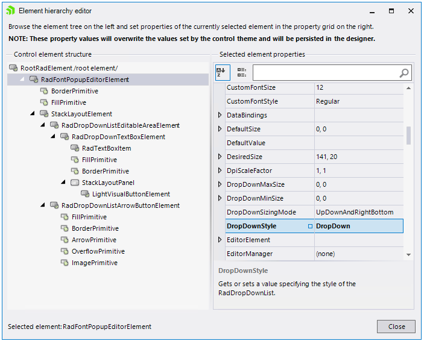
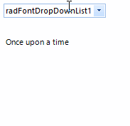

# Getting Started
 
The following tutorial demonstrates how to add a **RadFontDropDownList** and how to retrieve the selected font.

1. Add a **RadFontDropDownList** and a **RadLabel** to a form. 
2. Set some text to the **RadLabel** via the Properties section in Visual Studio.

	

3. Set the **DropDownStyle** property for the **RadFontPopupEditorElement** via the *Element hierrachy editor*:
 
	

5. Subscribe to the **SelectedFontChanged** event and use the following code snippet:
            
{{source=..\SamplesCS\Editors\FontDropDownList.cs region=ChangeFont}} 
{{source=..\SamplesVB\Editors\FontDropDownList.vb region=ChangeFont}} 

````C#
private void radFontDropDownList1_SelectedFontChanged(object sender, EventArgs e)
{
    FontFamily ff = new FontFamily(this.radFontDropDownList1.SelectedFont);
    if (ff.IsStyleAvailable(FontStyle.Regular))
    {
        Font font = new Font(ff.Name, 10, FontStyle.Regular);
        this.radLabel1.Font = font;
    }
    else
    {
        foreach (FontStyle style in Enum.GetValues(typeof(FontStyle)))
        {
            if (ff.IsStyleAvailable(style))
            {
                Font font = new Font(ff.Name, 10, style);
                this.radLabel1.Font = font;
                break;
            }
        }
    }
}

````
````VB.NET
Private Sub radFontDropDownList1_SelectedFontChanged(ByVal sender As Object, ByVal e As EventArgs)
    Dim ff As FontFamily = New FontFamily(Me.RadFontDropDownList1.SelectedFont)
    If ff.IsStyleAvailable(FontStyle.Regular) Then
        Dim font As Font = New Font(ff.Name, 10, FontStyle.Regular)
        Me.radLabel1.Font = font
    Else
        For Each style As FontStyle In [Enum].GetValues(GetType(FontStyle))
            If ff.IsStyleAvailable(style) Then
                Dim font As Font = New Font(ff.Name, 10, style)
                Me.radLabel1.Font = font
                Exit For
            End If
        Next
    End If
End Sub

````

{{endregion}} 


 
This is it! Now, the change in the selection of the **RadFontDropDownList** instance will be reflected on **RadLabel**'s font.
