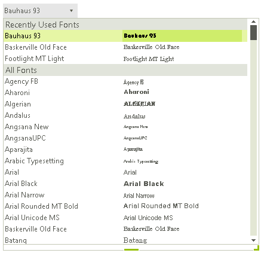

# WinForms DropDownList Overview

**RadFontDropDownList** represents a drop down list with built-in fonts that are installed on the system. Once you drag and drop the control onto the form, it is populated with all fonts installed on the machine and it is not necessary to do it programmatically. **RadFontDropDownList** displays recently used fonts along with a full list of all fonts. 





## Key Features

- Font selection
- Auto-complete functionality
- Recently used fonts
- Select on hover
- Customizing items' appearance

## Telerik UI for WinForms Learning Resources
* [Telerik UI for WinForms FontDropDownList Homepage](https://www.telerik.com/products/winforms/fontdropdownlist.aspx)
* [Get Started with the Telerik UI for WinForms FontDropDownList]()
* [Telerik UI for WinForms API Reference](https://docs.telerik.com/devtools/winforms/api/)
* [Getting Started with Telerik UI for WinForms Components]()
* [Telerik UI for WinForms Virtual Classroom (Training Courses for Registered Users)](https://learn.telerik.com/learn/course/external/view/elearning/17/TelerikUIforWinForms) 
* [Telerik UI for WinForms Forum](https://www.telerik.com/forums/winforms)
* [Telerik UI for WinForms Knowledge Base](https://docs.telerik.com/devtools/winforms/knowledge-base)

## Telerik UI for WinForms Additional Resources
* [Telerik UI for WinForms Product Overview](https://www.telerik.com/products/winforms.aspx)
* [Telerik UI for WinForms Blog](https://www.telerik.com/blogs/desktop-winforms)
* [Telerik UI for WinForms Videos](https://www.telerik.com/videos/product/winforms)
* [Telerik UI for WinForms Roadmap](https://www.telerik.com/support/whats-new/winforms/roadmap)
* [Telerik UI for WinForms Pricing](https://www.telerik.com/purchase/individual/winforms.aspx)
* [Telerik UI for WinForms Code Library](https://www.telerik.com/support/code-library/winforms)
* [Telerik UI for WinForms Support](https://www.telerik.com/support/winforms)
* [What’s New in Telerik UI for WinForms](https://www.telerik.com/support/whats-new/winforms)

## See Also

* [Structure]()
* [Design Time]()
