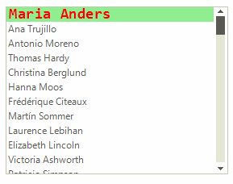
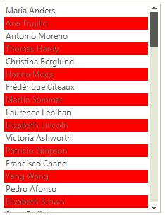

# Formatting Items

Items appearance in __RadListControl__ can be customized by making use of the __VisualItemFormatting__ event. The following example, demonstrates how you can change the color of an item which is being selected.

>note By using this event to customize the items appearance, you should always provide an *else* clause,  where you reset the appearance settings which you have introduced. This is necessary since __RadListControl__ uses data virtualization, which might lead to undesired appearance results when items are being reused.

>caption Figure 1: Formatting items



#### Formatting items

{{source=..\SamplesCS\DropDownListControl\ListControl\ListControl1.cs region=VisualItemFormatting}} 
{{source=..\SamplesVB\DropDownListControl\ListControl\ListControl1.vb region=VisualItemFormatting}} 

````C#
Font font = new Font("Consolas", 14, FontStyle.Bold);
private void radListControl1_VisualItemFormatting(object sender, VisualItemFormattingEventArgs args)
{
    if (args.VisualItem.Selected)
    {
        args.VisualItem.NumberOfColors = 1;
        args.VisualItem.BackColor = Color.LightGreen;
        args.VisualItem.ForeColor = Color.Red;
        args.VisualItem.BorderColor = Color.Blue;
        args.VisualItem.Font = font;
    }
    else
    {
        args.VisualItem.ResetValue(LightVisualElement.NumberOfColorsProperty, Telerik.WinControls.ValueResetFlags.Local);
        args.VisualItem.ResetValue(LightVisualElement.BackColorProperty, Telerik.WinControls.ValueResetFlags.Local);
        args.VisualItem.ResetValue(LightVisualElement.ForeColorProperty, Telerik.WinControls.ValueResetFlags.Local);
        args.VisualItem.ResetValue(LightVisualElement.BorderColorProperty, Telerik.WinControls.ValueResetFlags.Local);
        args.VisualItem.ResetValue(LightVisualElement.FontProperty, Telerik.WinControls.ValueResetFlags.Local);
    }
}

````
````VB.NET
Private font As New Font("Consolas", 14, FontStyle.Bold)
Private Sub radListControl1_VisualItemFormatting(sender As Object, args As VisualItemFormattingEventArgs)
    If args.VisualItem.Selected Then
        args.VisualItem.NumberOfColors = 1
        args.VisualItem.BackColor = Color.LightGreen
        args.VisualItem.ForeColor = Color.Red
        args.VisualItem.BorderColor = Color.Blue
        args.VisualItem.Font = font
    Else
        args.VisualItem.ResetValue(LightVisualElement.NumberOfColorsProperty, Telerik.WinControls.ValueResetFlags.Local)
        args.VisualItem.ResetValue(LightVisualElement.BackColorProperty, Telerik.WinControls.ValueResetFlags.Local)
        args.VisualItem.ResetValue(LightVisualElement.ForeColorProperty, Telerik.WinControls.ValueResetFlags.Local)
        args.VisualItem.ResetValue(LightVisualElement.BorderColorProperty, Telerik.WinControls.ValueResetFlags.Local)
        args.VisualItem.ResetValue(LightVisualElement.FontProperty, Telerik.WinControls.ValueResetFlags.Local)
    End If
End Sub
'#End Region
Class
gion customDataItem
ic Class CustomDataItem
rits RadListDataItem
Public Shared ReadOnly AvailableProperty As RadProperty = RadProperty.Register("Available", GetType(Boolean), GetType(CustomDataItem), New RadElementPropertyMetadata(False))
Public Property Available() As Boolean
    Get
        Return CBool(Me.GetValue(CustomDataItem.AvailableProperty))
    End Get
    Set(ByVal value As Boolean)
        Me.SetValue(CustomDataItem.AvailableProperty, value)
    End Set
End Property
Class

````

{{endregion}} 

## Alternating Item Color

__RadListControl__ supports alternating item color which can be easily enabled by just setting a couple of properties: 

{{source=..\SamplesCS\DropDownListControl\ListControl\ListControl1.cs region=alternating}} 
{{source=..\SamplesVB\DropDownListControl\ListControl\ListControl1.vb region=alternating}} 

````C#
radListControl1.EnableAlternatingItemColor = true;
radListControl1.ListElement.AlternatingItemColor = Color.Red;

````
````VB.NET
radListControl1.EnableAlternatingItemColor = True
radListControl1.ListElement.AlternatingItemColor = Color.Red
'#End Region
'#Region "AddItemsProgrammatically"
Dim descriptionItem As New DescriptionTextListDataItem()
descriptionItem.Text = "Chicken wings"
descriptionItem.Image = My.Resources.chicken_wings
descriptionItem.DescriptionText = "some description"
Me.radListControl1.Items.Add(descriptionItem)
Dim dataItem As New RadListDataItem()
dataItem.Text = "Chicken toast"
dataItem.Image = My.Resources.chicken_toast
Me.radListControl1.Items.Add(dataItem)
'#End Region
'#Region "expression"
Me.radListControl1.FilterExpression = "Country LIKE 'Argentina'"
'#End Region
End Sub
'#Region "Binding"
Public Class Item
Public Property Id() As Integer
    Get
        Return m_Id
    End Get
    Set(value As Integer)
        m_Id = value
    End Set
End Property
Private m_Id As Integer
Public Property Description() As String
    Get
        Return m_Description
    End Get
    Set(value As String)
        m_Description = value
    End Set
End Property
Private m_Description As String
Public Sub New(id As Integer, description As String)
    Me.Id = id
    Me.Description = description
End Sub
End Class
Public Sub Bind()
Dim items As New List(Of Item)()
For i As Integer = 0 To 9
    items.Add(New Item(i, "Data" + i))
Next
radListControl1.DataSource = items
radListControl1.DisplayMember = "Description"
radListControl1.ValueMember = "Id"
End Sub
'#End Region
'#region creatingVisualListItem
Private Sub radListControl1_CreatingVisualListItem(ByVal sender As Object, ByVal args As CreatingVisualListItemEventArgs)
args.VisualItem = New CustomVisualItem()
End Sub

````

{{endregion}} 

>caption Figure 2: AlternatingItemColor




