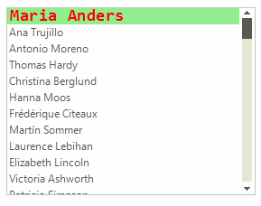
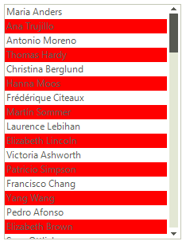

# Formatting Items

Items appearance in __RadListControl__ can be customized by making use of the __VisualItemFormatting__ event. The following example, demonstrates how you can change the color of an item which is being selected.

>note By using this event to customize the items appearance, you should always provide an *else* clause,  where you reset the appearance settings which you have introduced. This is necessary since __RadListControl__ uses data virtualization, which might lead to undesired appearance results when items are being reused.

>caption Figure 1: Formatting items

#### Formatting items

<snippet id='listcontrol-formatting-items-visualitemformatting-cs' />
<snippet id='listcontrol-formatting-items-visualitemformatting-vb' />

## Alternating Item Color

__RadListControl__ supports alternating item color which can be easily enabled by just setting a couple of properties: 

<snippet id='listcontrol-formatting-items-alternating-cs' />
<snippet id='listcontrol-formatting-items-alternating-vb' />

>caption Figure 2: AlternatingItemColor

