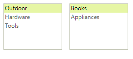

# Drag and Drop in Bound Mode

This article demonstrates how you can implement drag and drop operation between two bound __RadListControl__ controls. This example is using the [ole drag and drop](https://msdn.microsoft.com/en-us/library/96826a87.aspx)

Figure 1: The final result.

The drag and drop functionality is achieved with the help of four events: __MouseDown__, __MouseMove__, __DragEnter__, __DragDrop__:

1\. Handling the __MouseDown__ and __MouseMove__ events: The __MouseDown__ event is used for saving the position of the clicked element. It will be used later for getting the element under the mouse. The __MouseMove__ event can be used to start the drag and drop operation. It is started with the __DoDragDrop__ method only if the left mouse button is used and a valid item is clicked.
            
>note The __IsRealDrag__ method returns *true* only if the mouse have moved certain amount of pixels (determined by the operating system).
>

#### MouseDown and MouseMove 

<snippet id='listcontrol-drag-and-drop-in-bound-mode-mousedownmove-cs' />
<snippet id='listcontrol-drag-and-drop-in-bound-mode-mousedownmove-vb' />

 
2\. Handling the __DragEnter__ event: This event will fire when the mouse is hovering over a control that allows dropping. Here you can use it to disable the drop operation within the same control.

#### The DragEnter event handler 

<snippet id='listcontrol-drag-and-drop-in-bound-mode-dragenter-cs' />
<snippet id='listcontrol-drag-and-drop-in-bound-mode-dragenter-vb' />

 
3\. Handling the __DragDrop__ event: This is the most important event. In it you have access to both, the dragged element and the control where the item is dropped. This allows you to handle the drop operation appropriately according to your specific requirements. In this case, both controls are bound, and this allows you to just add/remove items from/to their data source (the changes will be immediately reflected by the controls).

#### The DragDrop event handler 

<snippet id='listcontrol-drag-and-drop-in-bound-mode-dragdrop-cs' />
<snippet id='listcontrol-drag-and-drop-in-bound-mode-dragdrop-vb' />

 
Additionally, you should enable the __AllowDrop__ property for both controls. With this example you can move from the first __RadListControl__ to the second and vice versa. Along with this, the following snippet shows how you can bind the controls and subscribe to the events. The same events are used for both controls. 

#### Controls initialization 

<snippet id='listcontrol-drag-and-drop-in-bound-mode-initialize-cs' />
<snippet id='listcontrol-drag-and-drop-in-bound-mode-initialize-vb' />

To complete the example you can use the following sample class.

#### Sample business object for the example 

<snippet id='listcontrol-drag-and-drop-in-bound-mode-customobject-cs' />
<snippet id='listcontrol-drag-and-drop-in-bound-mode-customobject-vb' />

