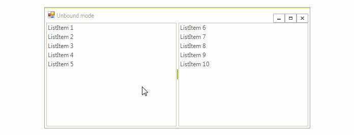
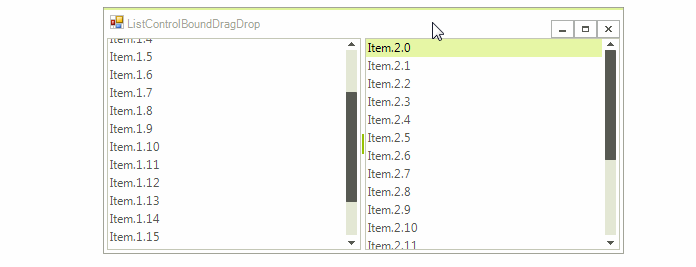

# ListControlDragDropService

Since *R1 2017 SP* **RadListControl** supports **ListControlDragDropService**. It is necessary to set the **AllowDragDrop** property to *true* in order to enable its functionality. The benefits that come with this service are:

* Items drag and drop behavior in unbound mode comes out of the box within the same **RadListControl** or between two **RadListControls**.

* **ListControlDragDropService** allows you to achieve drag and drop behavior in bound mode through its public API.

## Drag and drop in unbound mode out of the box

The following steps demonstrates how to populate two **RadListControls** with items in unbound mode and enable the drag and drop functionality between them.

1\. Add two **RadListControls** on your form and add some items via the *RadListDataItem Collection Editor*. 
2\. Set the **AllowDragDrop** property to *true* for both of the **RadListControls** either at design time in the *Properties* section of Visual Studio or via code at run time.
3\. Run the application and try to reorder the items.

>caption Figure 1: Drag and drop in unbound mode

## Drag and drop in bound mode by using ListControlDragDropService

1\. Consider that you have two **RadListControls** which are bound to a **BindingList** of custom *Item* objects. 

<snippet id='listcontrol-listcontroldragdropservice-boundlistcontrol-cs' />
<snippet id='listcontrol-listcontroldragdropservice-boundlistcontrol-vb' />

2\. Set the **AllowDragDrop** property for both of the **RadListControls** to *true*.

<snippet id='listcontrol-listcontroldragdropservice-enabledragdrop-cs' />
<snippet id='listcontrol-listcontroldragdropservice-enabledragdrop-vb' />

3\. Handle the service's events in order to achieve the desired drag and drop behavior. In the **PreviewDragStart** event of **ListControlDragDropService** you can store the dragged data item. Set the PreviewDragStartEventArgs.**CanStart** property to *true* in order to indicate the drag operation is allowed. The **PreviewDragOver** event allows you to control on what targets the item being dragged can be dropped on. The **PreviewDragDrop** event allows you to get a handle on all the aspects of the drag and drop operation, the source (drag) **RadListControl**, the destination (target) control, as well as the item being dragged. This is where we will initiate the actual physical move of the item(s) from **RadListControl** to the target control. 

<snippet id='listcontrol-listcontroldragdropservice-listcontroldragdrop-cs' />
<snippet id='listcontrol-listcontroldragdropservice-listcontroldragdrop-vb' />

>caption Figure 2: Drag and Drop in Bound Mode

# See Also

* [RadDragDropService]()	
