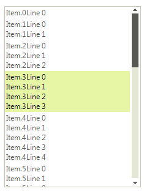

# Setting Item Size Constraints

__RadListControl__ has two modes that determine how large an item will be. These modes are controlled by the __AutoSizeItems__ property. Setting it to *true* will cause each item be as large as its content requires. Also in __AutoSizeItems__ mode, the user can explicitly set the *Height* property of each __RadListDataItem__. 

>caption Figure 1: AutoSizeItems

When __AutoSizeItems__ is *false* on the other hand, the user can set the height of every item at once with the __ItemHeight__ property of __RadListControl__. If users decide to set a large font for example, they either have to set __AutoSizeItems__ to *true* so that the items can stretch to accommodate the large text or to remain with __AutoSizeItems__ = *false* but set the __ItemHeight__ property to some value that will be enough to display the whole text.
