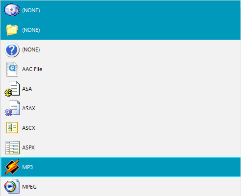

# Selection

The selection in __RadListControl__ is determined by the __SelectionMode__ property. The __SelectionMode__ offers four different selection modes which the user can choose from:

* __One__: The *One* means that only one item can be selected at a time. This is default mode.
* __None__: The *None* mode is pretty self descriptive. It does not allow selecting items at all. 
* __MultiSimple__: It allows toggling the selected state of an item by clicking on it or pressing the space bar. Using the keyboard arrow keys in *MultiSimple* mode moves only the active item. The active item is different than the normal and selected items. It has no fill color, only an outline. There can be only one active item at any given moment.
* __MultiExtended__: It is a combination of *One* and *MultiSimple* and on top of that provides the ability to select a range of items. *MultiExtended* by default behaves like *One*. When the `Control` key is pressed, it behaves like *MultiSimple* and when the `Shift` key is pressed, it allows the user to select a range of items starting from the currently selected item and ending with the clicked item.
 
>note There is **ActiveItem** property that gets or sets the active item. The **ActiveItem** is relevant only for **MultiSimple** and **MultiExtended** selection modes.

#### Set the selection mode
{{source=..\SamplesCS\DropDownListControl\ListControl\ListControl1.cs region=SelectionMode}} 
{{source=..\SamplesVB\DropDownListControl\ListControl\ListControl1.vb region=SelectionMode}} 

````C#
this.radListControl1.SelectionMode = SelectionMode.MultiSimple;

````
````VB.NET
Me.radListControl1.SelectionMode = SelectionMode.MultiSimple

````

{{endregion}}

## Select items programmatically 

In order to select an item programmatically you should use the **SelectedItem** property. You can select an item by index as well by using the **SelectedIndex** property. If you want to select an item by its value you can use the **SelectedValue** property. When usng the **SelectedValue** property a linear search is performed to find a data item that has the same value in its **Value** property.

#### Select items programmatically 
{{source=..\SamplesCS\DropDownListControl\ListControl\ListControl1.cs region=SelectItems}} 
{{source=..\SamplesVB\DropDownListControl\ListControl\ListControl1.vb region=SelectItems}} 

````C#
this.radListControl1.SelectedItem = this.radListControl1.Items[1];
this.radListControl1.SelectedIndex = 2;
this.radListControl1.SelectedValue = "MP3";

````
````VB.NET
Me.radListControl1.SelectedItem = Me.radListControl1.Items(1)
Me.radListControl1.SelectedIndex = 2
Me.radListControl1.SelectedValue = "MP3"

````

{{endregion}}



>note **SelectedItems** property gets the collection of selected items.

## Selection events

When the selection in **RadListControl** has changed, the following events are fired:

- **SelectedIndexChanged** - Occurs when the **SelectedIndex** has changed.
- **SelectedIndexChanging** - Occurs before **SelectedIndex** changes. This event allows the operation to be cancelled.
- **SelectedItemsChanged** - Occurs when the content of the **SelectedItems** collection has changed.
- **SelectedItemsChanging** - Occurs before the content of the **SelectedItems** collection has changed.
- **SelectedValueChanged** - This event fires only if the **SelectedValue** has really changed. For example it will not fire if the previously selected item has the same value as the newly selected item.

