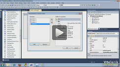
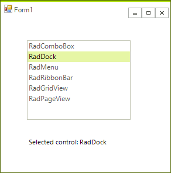

# Getting Started with WinForms ListControl

This article shows how you can start using **RadListControl**.

| RELATED VIDEOS |  |
| ------ | ------ |
|[Getting Started with RadListControl](http://www.telerik.com/videos/winforms/getting-started-with-radlistcontrol)<br>In this video, you will learn how to bind data to the new RadListControl.||

## Adding Telerik Assemblies Using NuGet

To use `RadListControl` when working with NuGet packages, install the `Telerik.UI.for.WinForms.AllControls` package. The [package target framework version may vary]().

Read more about NuGet installation in the [Install using NuGet Packages]() article.

>tip With the 2025 Q1 release, the Telerik UI for WinForms has a new licensing mechanism. You can learn more about it [here]().

## Adding Assembly References Manually

When dragging and dropping a control from the Visual Studio (VS) Toolbox onto the Form Designer, VS automatically adds the necessary assemblies. However, if you're adding the control programmatically, you'll need to manually reference the following assemblies:

* __Telerik.Licensing.Runtime__
* __Telerik.WinControls__
* __Telerik.WinControls.UI__
* __TelerikCommon__

The Telerik UI for WinForms assemblies can be install by using one of the available [installation approaches](). 

## Defining the RadListControl

This tutorial demonstrates how to manually populate __RadListControl__ and how to react to a user's choice in code.

1\. Place a __RadListControl__ and a __RadLabel__ control on a form.

2\. Select the __RadListControl__ control, open its __Smart Tag__ menu.

3\. Select the __Edit Items__ task.

4\. In the __RadItem Collection Editor__, click __Add__.

5\. Set the __Text__ property of the new __ListItem__ to "RadComboBox". 

>caption Figure 1: RadListDataItem Collection Editor


6\. Add five more ListItems to the RadListControl. Set their __Text__ properties to "RadDock", "RadMenu", "RadRibbonBar", "RadGridView", and "RadPageView".

7\. Click __OK__.

8\. In the __Properties__ window, click the events button.

9\. Double-click the __SelectedIndexChanged__ event.

10\. Replace the automatically-generated event handler with this code:

#### Handling the SelectedIndexChanged event 

{{source=..\SamplesCS\DropDownListControl\ListControl\ListControl1.cs region=handlingSelectedIndexChanged}} 
{{source=..\SamplesVB\DropDownListControl\ListControl\ListControl1.vb region=handlingSelectedIndexChanged}} 

````C#
void radListControl1_SelectedIndexChanged(object sender, Telerik.WinControls.UI.Data.PositionChangedEventArgs e)
{
    RadListDataItem item = this.radListControl1.SelectedItem as RadListDataItem;
    radLabel1.Text = "Selected control: " + item.Text;
}

````
````VB.NET
Private Sub radListControl1_SelectedIndexChanged(ByVal sender As Object, ByVal e As Telerik.WinControls.UI.Data.PositionChangedEventArgs)
    Dim item As RadListDataItem = TryCast(Me.radListControl1.SelectedItem, RadListDataItem)
    radLabel1.Text = "Selected control: " & item.Text
End Sub

````

{{endregion}} 


11\. Press __F5__ to run the project. Select an item in the list box and note the value of the label.



## See Also

* [Adding Items Programmatically]()
* [Data Binding]()

## Telerik UI for WinForms Learning Resources
* [Telerik UI for WinForms Listcontrol Component](https://www.telerik.com/products/winforms/listcontrol.aspx)
* [Getting Started with Telerik UI for WinForms Components](https://docs.telerik.com/devtools/winforms/getting-started/first-steps)
* [Telerik UI for WinForms Setup](https://docs.telerik.com/devtools/winforms/installation-and-upgrades/installing-on-your-computer)
* [Telerik UI for WinForms Application Modernization](https://docs.telerik.com/devtools/winforms/winforms-converter/overview)
* [Telerik UI for WinForms Visual Studio Templates](https://docs.telerik.com/devtools/winforms/visual-studio-integration/visual-studio-templates)
* [Deploy Telerik UI for WinForms Applications](https://docs.telerik.com/devtools/winforms/deployment-and-distribution/application-deployment)
* [Telerik UI for WinForms Virtual Classroom(Training Courses for Registered Users)](https://learn.telerik.com/learn/course/external/view/elearning/17/telerik-ui-for-winforms)
* [Telerik UI for WinForms License Agreement)](https://www.telerik.com/purchase/license-agreement/winforms-dlw-s)

