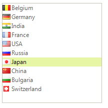

# WinForms ListControl Overview

__RadListControl__ is the an alternative to the Microsoft ListBox control. Due to the innovative and specially designed architecture of __RadListControl__, this control allows for superior data binding speed and a visual (GUI) representation that allows for a responsive control even when working with huge data sets.





   
## RadListDataItem
     
The logical items that __RadListControl__ creates internally are of type __RadListDataItem__. __RadListDataItem__ is very lightweight since it has a much shorter inheritance chain. This provides the ability to create thousands of __RadListDataItems__ in a matter of milliseconds.__RadListDataItem__ is also a fundamental point of extensibility allowing creation of objects (inheritors of __RadListDataItem__) which in turn allow the user to logically represent their data as accurately as possible, for example by adding properties to the __RadListDataItem__ inheritor that are specific to a certain type of data. Another important fact is that the logical items are no longer being displayed directly, __RadListDataItem__ inherits only from __RadObject__ which makes it incompatible with the __RadElement__ tree structure that __RadControl__ provides an entry point to. In order to visually format the data stored in a particular __RadListDataItem__ instance __RadListControl__ creates a separate visual item which is of type __RadListVisualItem__.        

## RadListVisualItem

__RadListVisualItem__ is the class that is used to visually represent the __RadListDataItems__ in __RadListControl__. There is a virtualization mechanism that creates only a few visual items, just enough to fill the area that __RadListControl__ occupies on a form and to allow scrolling. For example, if a __RadListControl__ instance is 100 pixels tall and the list item height has been set to be 20, __RadListControl__ will create only 5 visual items. But how can 5 items visually represent possibly thousands of logical __RadListDataItems__? The virtualization mechanism does this by simply mapping the visual items to the logical items taking into account the scroll bar value. For example, if you scroll down by one item, all visual items will be mapped to one below the previous logical item that they were mapped to initially. In essence, the logical items shift under the visual items and the visual items update accordingly. This means that updating the UI is a constant operation and is instantaneous in the majority of use cases. __RadListVisualItem__ is the second major point of extensibility. __RadListControl__ allows creating custom visual items, just like the logical items, which allows the user to visually represent their custom data as close as possible.        

The rest of the help articles in this section describe in more detail the logical items, the visual items, how to extend them and the other features that __RadListControl__ provides out of the box.

## Telerik UI for WinForms Learning Resources
* [Telerik UI for WinForms ListControl Homepage](https://www.telerik.com/products/winforms/listcontrol.aspx)
* [Get Started with the Telerik UI for WinForms ListControl]()
* [Telerik UI for WinForms API Reference](https://docs.telerik.com/devtools/winforms/api/)
* [Getting Started with Telerik UI for WinForms Components]()
* [Telerik UI for WinForms Virtual Classroom (Training Courses for Registered Users)](https://learn.telerik.com/learn/course/external/view/elearning/17/TelerikUIforWinForms) 
* [Telerik UI for WinForms Forum](https://www.telerik.com/forums/winforms)
* [Telerik UI for WinForms Knowledge Base](https://docs.telerik.com/devtools/winforms/knowledge-base)

## Telerik UI for WinForms Additional Resources
* [Telerik UI for WinForms Product Overview](https://www.telerik.com/products/winforms.aspx)
* [Telerik UI for WinForms Blog](https://www.telerik.com/blogs/desktop-winforms)
* [Telerik UI for WinForms Videos](https://www.telerik.com/videos/product/winforms)
* [Telerik UI for WinForms Roadmap](https://www.telerik.com/support/whats-new/winforms/roadmap)
* [Telerik UI for WinForms Pricing](https://www.telerik.com/purchase/individual/winforms.aspx)
* [Telerik UI for WinForms Code Library](https://www.telerik.com/support/code-library/winforms)
* [Telerik UI for WinForms Support](https://www.telerik.com/support/winforms)
* [What’s New in Telerik UI for WinForms](https://www.telerik.com/support/whats-new/winforms)

# See Also

* [Getting Started]()
        
