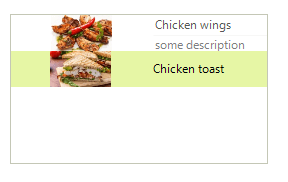

# Adding items programmatically

__RadListControl__ supports adding items at run time, which means that you can manually populate it with data. The following example demonstrates how to add two different items to the RadListControl.__Items__  collection. 

You can use one of the following item types: 

* __RadListDataItem__ – it represents a logical data item which can display specific text and image.             
              

* __DescriptionTextListDataItem__ – similar to the __RadListDataItem__. In addition, it displays some description below the item’s text.


>caption Figure 1: Sample RadListDataItem and DescriptionTextListDataItem



#### Add items programmatically 

{{source=..\SamplesCS\DropDownListControl\ListControl\ListControl1.cs region=AddItemsProgrammatically}} 
{{source=..\SamplesVB\DropDownListControl\ListControl\ListControl1.vb region=AddItemsProgrammatically}} 

````C#
DescriptionTextListDataItem descriptionItem = new DescriptionTextListDataItem();
descriptionItem.Text = "Chicken wings";
descriptionItem.Image = Properties.Resources.chicken_wings;
descriptionItem.DescriptionText = "some description";
this.radListControl1.Items.Add(descriptionItem);
RadListDataItem dataItem = new RadListDataItem();
dataItem.Text = "Chicken toast";
dataItem.Image = Properties.Resources.chicken_toast;
this.radListControl1.Items.Add(dataItem);

````
````VB.NET
Dim descriptionItem As New DescriptionTextListDataItem()
descriptionItem.Text = "Chicken wings"
descriptionItem.Image = My.Resources.chicken_wings
descriptionItem.DescriptionText = "some description"
Me.radListControl1.Items.Add(descriptionItem)
Dim dataItem As New RadListDataItem()
dataItem.Text = "Chicken toast"
dataItem.Image = My.Resources.chicken_toast
Me.radListControl1.Items.Add(dataItem)
'#End Region
'#Region "expression"
Me.radListControl1.FilterExpression = "Country LIKE 'Argentina'"
'#End Region
End Sub
'#Region "Binding"
Public Class Item
Public Property Id() As Integer
    Get
        Return m_Id
    End Get
    Set(value As Integer)
        m_Id = value
    End Set
End Property
Private m_Id As Integer
Public Property Description() As String
    Get
        Return m_Description
    End Get
    Set(value As String)
        m_Description = value
    End Set
End Property
Private m_Description As String
Public Sub New(id As Integer, description As String)
    Me.Id = id
    Me.Description = description
End Sub
End Class
Public Sub Bind()
Dim items As New List(Of Item)()
For i As Integer = 0 To 9
    items.Add(New Item(i, "Data" + i))
Next
radListControl1.DataSource = items
radListControl1.DisplayMember = "Description"
radListControl1.ValueMember = "Id"
End Sub
'#End Region
'#region creatingVisualListItem
Private Sub radListControl1_CreatingVisualListItem(ByVal sender As Object, ByVal args As CreatingVisualListItemEventArgs)
args.VisualItem = New CustomVisualItem()
End Sub

````

{{endregion}} 

# See Also

* [Design Time]()
* [Data Binding]()

