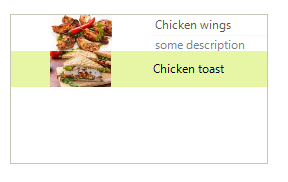

# Adding items programmatically

__RadListControl__ supports adding items at run time, which means that you can manually populate it with data. The following example demonstrates how to add two different items to the RadListControl.__Items__  collection. 

You can use one of the following item types: 

* __RadListDataItem__ – it represents a logical data item which can display specific text and image.             
              

* __DescriptionTextListDataItem__ – similar to the __RadListDataItem__. In addition, it displays some description below the item’s text.

>caption Figure 1: Sample RadListDataItem and DescriptionTextListDataItem

#### Add items programmatically 

<snippet id='listcontrol-adding-items-programmatically-additemsprogrammatically-cs' />
<snippet id='listcontrol-adding-items-programmatically-additemsprogrammatically-vb' />

# See Also

* [Design Time]()
* [Data Binding]()

