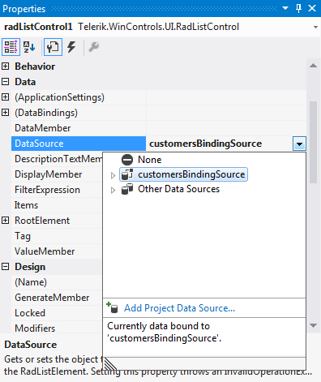
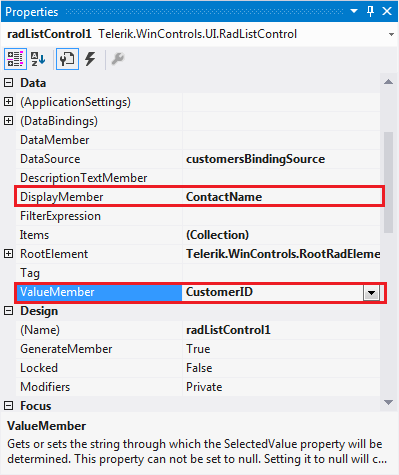
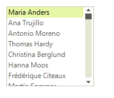

# DataBinding
 
Data binding provides a way to bind the display of data in a __RadListControl__ to a data source. Three properties control data binding:

* The __DataSource__ property specifies the source of the data to be bound.

* The __DisplayMember__ property specifies the particular data to be displayed in a __RadListControl__.

* The __ValueMember__ property specifies the particular data to be returned as the value of a __RadListControl__.

## Data binding at design time

You can set the __DataSource__ property at design time in the *Properties* window of Visual Studio.

1. Select the __DataSource__ property and click the drop-down arrow to display all existing data sources on the form. 

1. Click the *Add Project Data Source…* link and follow the instructions in the *Data Source Configuration Wizard*  to add a data source to your project. You can use a single database table. 

	>caption Figure: 1 Setting the DataSource at Design time

	

1. Afterwards, you need to specify the __DisplayMember__ and __ValueMember__ properties.

	>caption Figure: 2 Setting the DisplayMember and ValueMember properties at Design time

	

	>caption Figure: 3 RadListControl bound at Design time

	

## Data binding at run time

{{source=..\SamplesCS\DropDownListControl\ListControl\ListControl1.cs region=Binding}} 
{{source=..\SamplesVB\DropDownListControl\ListControl\ListControl1.vb region=Binding}} 

````C#
public class Item
{
    public int Id { get; set; }
    public string Description { get; set; }
    public Item(int id, string description)
    {
        this.Id = id;
        this.Description = description;
    }
}
public void Bind()
{
    List<Item> items = new List<Item>();
    for (int i = 0; i < 10; i++)
    {
        items.Add(new Item(i, "Data" + i));
    }
    radListControl1.DataSource = items;
    radListControl1.DisplayMember = "Description";
    radListControl1.ValueMember = "Id";
}

````
````VB.NET
Public Class Item
    Public Property Id() As Integer
        Get
            Return m_Id
        End Get
        Set(value As Integer)
            m_Id = value
        End Set
    End Property
    Private m_Id As Integer
    Public Property Description() As String
        Get
            Return m_Description
        End Get
        Set(value As String)
            m_Description = value
        End Set
    End Property
    Private m_Description As String
    Public Sub New(id As Integer, description As String)
        Me.Id = id
        Me.Description = description
    End Sub
End Class
Public Sub Bind()
    Dim items As New List(Of Item)()
    For i As Integer = 0 To 9
        items.Add(New Item(i, "Data" + i))
    Next
    radListControl1.DataSource = items
    radListControl1.DisplayMember = "Description"
    radListControl1.ValueMember = "Id"
End Sub
'#End Region
'#region creatingVisualListItem
Private Sub radListControl1_CreatingVisualListItem(ByVal sender As Object, ByVal args As CreatingVisualListItemEventArgs)
    args.VisualItem = New CustomVisualItem()
End Sub

````

{{endregion}}  

>caption Figure: 4 RadListControl bound at Run time


# See Also

* [Design Time]()
* [Adding Items Programmatically]()