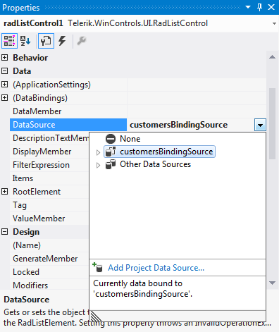
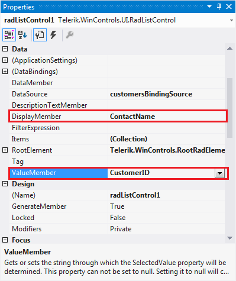
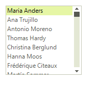
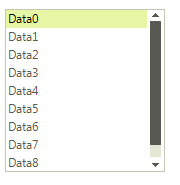

# DataBinding
 
Data binding provides a way to bind the display of data in a __RadListControl__ to a data source. Three properties control data binding:

* The __DataSource__ property specifies the source of the data to be bound.

* The __DisplayMember__ property specifies the particular data to be displayed in a __RadListControl__.

* The __ValueMember__ property specifies the particular data to be returned as the value of a __RadListControl__.

## Data binding at design time

You can set the __DataSource__ property at design time in the *Properties* window of Visual Studio.

1. Select the __DataSource__ property and click the drop-down arrow to display all existing data sources on the form. 

1. Click the *Add Project Data Source…* link and follow the instructions in the *Data Source Configuration Wizard*  to add a data source to your project. You can use a single database table. 

	>caption Figure: 1 Setting the DataSource at Design time

	

1. Afterwards, you need to specify the __DisplayMember__ and __ValueMember__ properties.

	>caption Figure: 2 Setting the DisplayMember and ValueMember properties at Design time

	

	>caption Figure: 3 RadListControl bound at Design time

	

## Data binding at run time

<snippet id='listcontrol-databinding-binding-cs' />
<snippet id='listcontrol-databinding-binding-vb' />

>caption Figure: 4 RadListControl bound at Run time

# See Also

* [Design Time]()
* [Adding Items Programmatically]()
