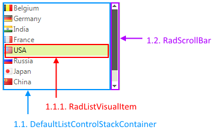

# Structure

This article describes the inner structure and organization of the elements which build the __RadListControl__ control.
        
>caption Figure 1: RadListControl's elements hierarchy

>caption Figure 2: RadListControl's structure

 1. RadListElement  
  1.1 DefaultListControlStackContainer   
&nbsp;&nbsp;&nbsp;&nbsp;&nbsp;1.1.1 RadListVisualItem  
  1.2 RadScrollBar  

# See Also

* [RadControlSpy]()
            
