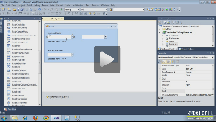
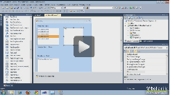
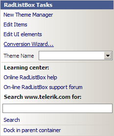
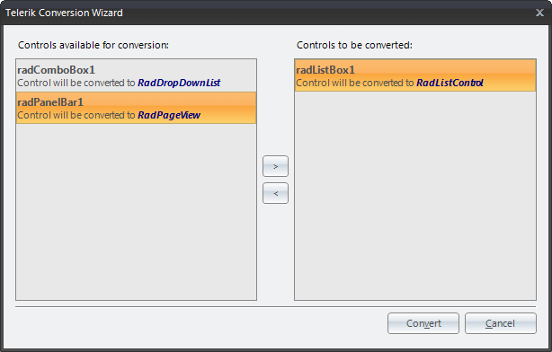

# Upgrading to DropDownList and ListControl
 
| RELATED VIDEOS |  |
| ------ | ------ |
|[WinForms DropDown and ListControl Converting from RadComboBox to RadDropDownList](http://tv.telerik.com/watch/winforms/converting-from-radcombobox-to-raddropdownlist) In this video, you will learn how to convert a __RadComboBox__ to the new __RadDropDownList__ control introduced in the Q2 2010 release of RadControls for WinForms.||
|[WinForms DropDown and ListControl Converting from RadListBox to RadListControl](http://tv.telerik.com/watch/winforms/converting-from-radlistbox-to-radlistcontrol) In this video, you will learn how to convert a RadListBox to the new RadListControl introduced in the R2 2010 release of RadControls for WinForms.||

## 

>note This article is valid for Telerik UI for WinForms versions prior to __R2 2011 SP1__ inclusive. The Upgrade Tool can be used only if started from the Smart Tag of the obsolete controls. Since these controls have been removed in __R3 2011__, their respective Upgrade Tools are not available as well. In case you want to use the tools, please upgrade/downgrade to __R2 2011 SP1__ (v2011.2.11.831)
>
 
Since Q2 2010 several brand new controls were released, as successors of older and not that optimized controls. These are:

* [RadListControl](http://www.telerik.com/help/winforms/dropdown-and-listcontrol-listcontrol-overview.html) - successor of __RadListBox__.
          

* [RadDropDownList](http://www.telerik.com/help/winforms/dropdown-and-listcontrol-dropdownlist-overview.html) - successor of __RadComboBox__.
          

* [RadPageView](http://www.telerik.com/help/winforms/pageview-overview.html) - successor of __RadTabStrip__ and __RadPanelBar__.
          

In order to encourage our users to use the new controls, we have removed all the old controls from our Toolbox. But what about old controls, present in already existing applications? A manual conversion by simply dropping the new control and moving the entire content of the old control to the new one is not a straightforward process. Here comes the new tool, introduced in our __Q2 2010 Service Pack 1__ release, namely Telerik Conversion Wizard. The tool is available as a smart tag option in all Telerik Controls:

*The "Conversion Wizard…" command will open the wizard dialog:*

*On the left side are listed all the controls, available for conversion, while on the right side are all the controls that will be actually converted. The two lists can be organized using the buttons in the middle.*

Upon loading the tool will loop through all the components registered with the current design surface and will populate the ones that may be converted to newer controls. All the controls that will be converted should be put in the right list and the “Convert” button should be clicked.

>note __RadPageView__ does not support adding elements directly to a __RadPageViewPage__. Hence, a conversion from __RadPanelBar__ will create empty pages for element-based groups. Only groups that are used as control hosts will be completely converted. Old controls will be DELETED upon conversion, so make sure that you have backed-up your projects first.
> 

>note Events are not converted. When you convert an obsolete control, your event handler methods will remain intact, but it is important to note that the event subscriptions will be cleared.
>

