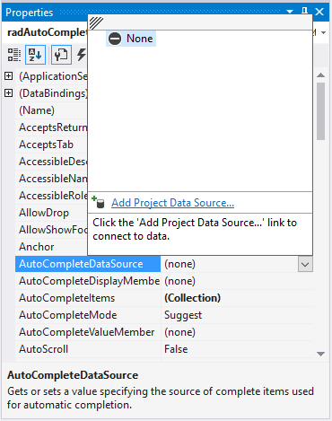
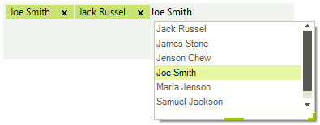
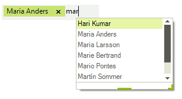
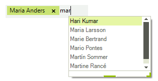

# Auto-Complete

The __RadAutoCompleteBox__ can automatically complete the input string by comparing the prefix being entered to the prefix of all strings in the maintained source. This is useful for __RadAutoCompleteBox__ where URLs, addresses, file names or commands will be frequently entered.
        

There are four different modes:

* __Append:__  Appends the remainder of the most likely candidate string to the existing characters, highlighting the appended characters. 
		  	

* __None:__ - disables the automatic completion feature. 
		 	 

* __Suggest:__ - Displays the auxiliary drop-down list associated with the edit control. This drop-down is populated with all matching completion strings.
		 	 

* __SuggestAppend:__ - Applies both `Suggest` and `Append` options.
		 	 

You can change the completion behavior by setting the __AutoCompleteMode__ property. You can determine the items used for auto-completion by specifying a data source or adding the items manually.

## Auto-completion data binding

__RadAutoCompleteBox__ can be bound to the following data sources:

* Array and ArrayList of simple types or custom objects.

* Generic Lists of simple types or custom objects.

* BindingList or other IBindingList implementations.

* Database data using DataTable and DataSet from a wide range of providers (MS SQL, Oracle, Access, anything accessible through OleDb).

Three properties control data binding:

* The __AutoCompleteDataSource__ property specifies the source of the data to be bound.

* The __AutoCompleteDisplayMember__ property specifies the particular data to be displayed in the auto-completion drop down.

* The __AutoCompleteValueMember__ property specifies the particular data to be returned as the value of the tokenized block element.

To set the __AutoCompleteDataSource__ property, select the __AutoCompleteDataSource__ in the `Properties` window of Visual Studio, click the drop-down arrow to display all existing data sources on the form. Click the `Add Project Data Source` link and follow the instructions in the `Data Source Configuration Wizard` to add a data source to your project. You can use databases, web services, or objects as data sources.

>caption Figure 1: The AutoCompleteDataSource property in Visual Studio.        

__AutoCompleteDisplayMember__: To set the __AutoCompleteDisplayMember__ property, first set the data source property. Then, select a value for the __AutoCompleteDisplayMember__ property from the drop-down list in the Properties window.
		

__AutoCompleteValueMember__: To set the __AutoCompleteValueMember__ property, first set the __AutoCompleteDataSource__ property. Then, select a value for the __AutoCompleteValueMember__ property from the drop-down list in the Properties window.
		 
## Auto-completion in unbound mode

To use auto-completion without specifying a data source, you need to populate the items which will be used for completing the input string in RadAutoCompleteBox in the __Items__ collection of the control: 

<snippet id='editors-autocompletebox-additems-cs' />
<snippet id='editors-autocompletebox-additems-vb' />

>caption Figure 2: RadAutoCompleteBox with some items added directly. 

## Allow Duplicates

As of **R1 2020 SP1** **RadAutoCompleteBox** offers the **AllowDuplicates** property. It controls whether already selected items can be suggested.

|AllowDuplicates=true|AllowDuplicates=false|
|----|----|
|||

Note that you can still add duplicated tokens in the editor if you type them manually. In order to avoid that you can subscribe to **TokenValidating** event and if the existing text in **RadAutoCompleteBox** contains the new text, set the **IsValidToken** property to *false*. The **TokenValidating** event will be called for each token that is going to be added to the control text area.

<snippet id='editors-autocompletebox-invalidtoken-cs' />
<snippet id='editors-autocompletebox-invalidtoken-vb' />

# See Also

* [Caret Positioning and Selection]()
* [Creating Custom Blocks]()
* [Element Structure and Document Object Model]()
* [Properties and Events]()
* [Text Editing]()
* [How to add image icons to RadAutoCompleteBox]()
* [How to Create Custom AutoComplete Items in RadAutoCompleteBox]()
