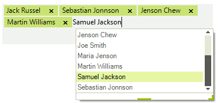

# WinForms AutoCompleteBox Overview

__RadAutoCompleteBox__ allows the end-user to easily fill-in text thanks to auto-complete functionality and tokens of text. This behavior is similar to the "To" field of Outlook and Facebook where you are filling-in the recipients to which you are going to send a message:




     
>caption Figure 1: RadAutoCompleteBox 

Key Features:

* Different layout modes.

* Outlook style auto-complete in bound and unbound mode.

* Customizable appearance and theming mechanism.

* Selection and navigation.

* Localization. 

* Flexible and intuitive API.

* IME support

## Telerik UI for WinForms Learning Resources
* [Telerik UI for WinForms AutoCompleteBox Homepage](https://www.telerik.com/products/winforms/autocompletebox.aspx)
* [Get Started with the Telerik UI for WinForms AutoCompleteBox]()
* [Telerik UI for WinForms API Reference](https://docs.telerik.com/devtools/winforms/api/)
* [Getting Started with Telerik UI for WinForms Components]()
* [Telerik UI for WinForms Virtual Classroom (Training Courses for Registered Users)](https://learn.telerik.com/learn/course/external/view/elearning/17/TelerikUIforWinForms) 
* [Telerik UI for WinForms Forum](https://www.telerik.com/forums/winforms)
* [Telerik UI for WinForms Knowledge Base](https://docs.telerik.com/devtools/winforms/knowledge-base)

## Telerik UI for WinForms Additional Resources
* [Telerik UI for WinForms Product Overview](https://www.telerik.com/products/winforms.aspx)
* [Telerik UI for WinForms Blog](https://www.telerik.com/blogs/desktop-winforms)
* [Telerik UI for WinForms Videos](https://www.telerik.com/videos/product/winforms)
* [Telerik UI for WinForms Roadmap](https://www.telerik.com/support/whats-new/winforms/roadmap)
* [Telerik UI for WinForms Pricing](https://www.telerik.com/purchase/individual/winforms.aspx)
* [Telerik UI for WinForms Code Library](https://www.telerik.com/support/code-library/winforms)
* [Telerik UI for WinForms Support](https://www.telerik.com/support/winforms)
* [What’s New in Telerik UI for WinForms](https://www.telerik.com/support/whats-new/winforms)

# See Also

* [Caret Positioning and Selection]()
* [Creating Custom Blocks]()
* [Element Structure and Document Object Model]()
* [Properties and Events]()
* [Text Editing]()
* [Auto-Complete]()
