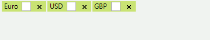

# Creating Custom Blocks

__RadAutoCompleteBox__ allows not only appearance customization via the formatting event, but also replacement of the default UI block representation. The __CreateTextBlock__ event exposes this possibility.
        

You should create a custom text block that inherits from __ITextBlock__ and any inheritor of __RadElement__. Let’s extend the default __TokenizedTextBlockElement__ by adding a check box. You don’t need to implement the __ITextBlock__ interface, because it is already defined in the base class: 

<snippet id='editors-autocompletebox-customtokens-cs' />
<snippet id='editors-autocompletebox-customtokens-vb' />

Then you should replace the default text block in the __CreateTextBlock__ event handler, in the following manner: 

<snippet id='editors-autocompletebox-replacetokens-cs' />
<snippet id='editors-autocompletebox-replacetokens-vb' />

Finally, the text property should be set:

>note The subscription to the event, should be introduced before setting the text of the control.
>
 

<snippet id='editors-autocompletebox-subscribetocreatetextblock-cs' />
<snippet id='editors-autocompletebox-subscribetocreatetextblock-vb' />

The following image demonstrates the final result:

# See Also

* [Caret Positioning and Selection]() 
* [Element Structure and Document Object Model]()
* [Properties and Events]()
* [Text Editing]()
* [Auto-Complete]()
