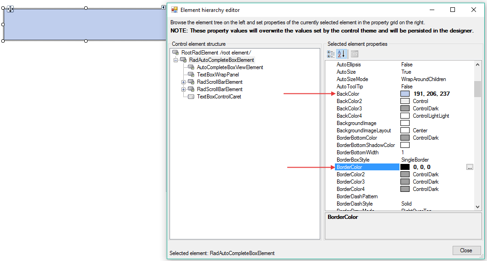

# Customize Fill and Border

You can easily customize the fill and border in the `Element Hierarchy editor`. The following steps are showing how to do that:

1. Open the `Element Hierarchy editor` from the smart tag.
2. Select __RadAutoCompleteBoxElement__. Make sure that the __DrawFill__ property is set to *true*.
3. Change the __BackColor__ and the __BorderColor__ properties:
    

# See Also

* [Themes]()
* [Formatting Blocks]()
