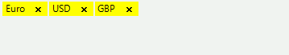

# Formatting Blocks

The __RadAutoCompleteBox__ allows appearance customization of each instance of __ITextBlock__. This can be easily achieved by subscribing to the __FormattingTextBlock__ event: 

<snippet id='editors-autocompletebox-formatting-cs' />
<snippet id='editors-autocompletebox-formatting-vb' />

>caption Figure 1: Items with yellow background.

Note that the event occurs when the text blocks are repositioned. This happens in different cases - editing, control resizing and etc. Hence, you should subscribe to the event before initializing the __Text__ property.
		
# See Also

* [Customize Fill and Border]()
* [Themes]()
