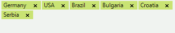
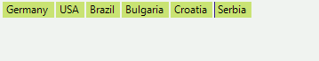

# Getting Started
 

| RELATED VIDEOS |  |
| ------ | ------ |
|[Getting Started with RadAutoCompleteBox for WinForms](http://tv.telerik.com/watch/radcontrols-for-winforms/getting-started-with-radautocompletebox-for-winforms)<br>RadAutoCompleteBox allows the end-user to easily fill-in text thanks to auto-complete functionality and tokens of text. This behavior is similar to the “To” field of Outlook and Facebook where you are filling-in the recipients to which you are going to send a new message.||


The __RadAutoCompleteBox__ allows your users to select multiple items from a predefined list, using auto completion as they type. You may have seen a similar type of text entry when filling in the recipient’s field, while sending messages on Facebook. __RadAutoCompleteBox__ inherits all features of [RadTextBoxControl]().
        

Each tokenized text block is separated by character, specified by the __Delimiter__ property. You can change the __Delimiter__ at any time.
         
The code below sets text in the control at run time: 

{{source=..\SamplesCS\editors\AutoCompleteBox.cs region=SetText}} 
{{source=..\SamplesVB\editors\AutoCompleteBox.vb region=SetText}} 

````C#
private void SetText()
{
    this.radAutoCompleteBox1.Text = "Germany;USA;Brazil;Bulgaria;Croatia;Serbia;";
}

````
````VB.NET
Private Sub SetText()
    Me.RadAutoCompleteBox1.Text = "Germany;USA;Brazil;Bulgaria;Croatia;Serbia;"
End Sub

````

{{endregion}} 
 
>caption Figure 1: Set the text of RadAutoCompleteBox.



You can determine the visibility of the remove button by changing the __ShowRemoveButton__ property: 

{{source=..\SamplesCS\editors\AutoCompleteBox.cs region=ShowRemoveButton}} 
{{source=..\SamplesVB\editors\AutoCompleteBox.vb region=ShowRemoveButton}} 

````C#
this.radAutoCompleteBox1.ShowRemoveButton = false;

````
````VB.NET
Me.RadAutoCompleteBox1.ShowRemoveButton = False

````

{{endregion}} 

>caption Figure 2: The Tokenized items are not showing the close button.




# See Also

* [Caret Positioning and Selection]()
* [Creating Custom Blocks]()
* [Element Structure and Document Object Model]()
* [Properties and Events]()
* [Text Editing]()
* [Auto-Complete]()
