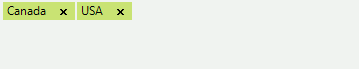
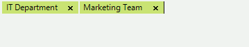
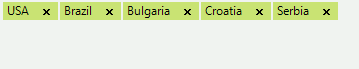

# Text Editing

The editing point is determined by the caret position and selection in __RadAutoCompleteBox__. The editing position is visible only if the control is focused.
        

You can insert text programmatically at concrete position by using the __Insert__ method. In this case, the text is inserted at the position determined by the __SelectionStart__ property. If the __SelectionLength__ property is greater than zero, the inserted text replaces the selected text. 

#### Using the Insert method.

<snippet id='editors-autocompletebox-insert-cs' />
<snippet id='editors-autocompletebox-insert-vb' />

>caption Figure 1: Inserting text.

Alternatively, you can insert text at the end of the __RadAutoCompleteBox__ content by using the __AppendText__ method: 

#### Using the AppendText method. 

<snippet id='editors-autocompletebox-append-cs' />
<snippet id='editors-autocompletebox-append-vb' />

>caption Figure 2: The text is appended at the end.

You can delete the selected text or character at the caret position by using the __Delete__ method: 

#### Using the Delete method.

<snippet id='editors-autocompletebox-delete-cs' />
<snippet id='editors-autocompletebox-delete-vb' />

>caption Figure 3: The firs word is deleted. 

Each editing operation raises the __TextChanging__ and __TextChanged__ events. Notice that you can prevent successful finishing of operation by subscribing to the __TextChanging__ event: 

#### Prevent deleting a tokenized text blocks in RadAutoCompleteBox.

<snippet id='editors-autocompletebox-preventdeleteoftokens-cs' />
<snippet id='editors-autocompletebox-preventdeleteoftokens-vb' />

The code above prevents deleting a tokenized text blocks in RadAutoCompleteBox.

# See Also

* [Caret Positioning and Selection]()
* [Creating Custom Blocks]()
* [Element Structure and Document Object Model]()
* [Properties and Events]()
* [Auto-Complete]()
