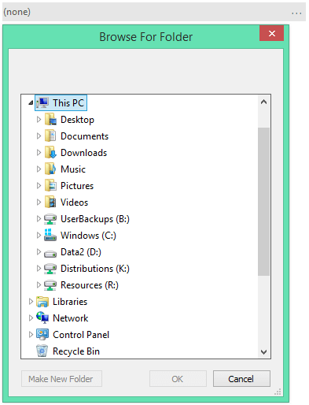
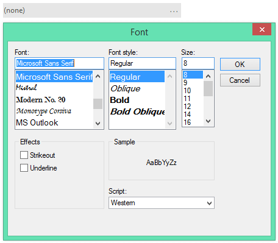
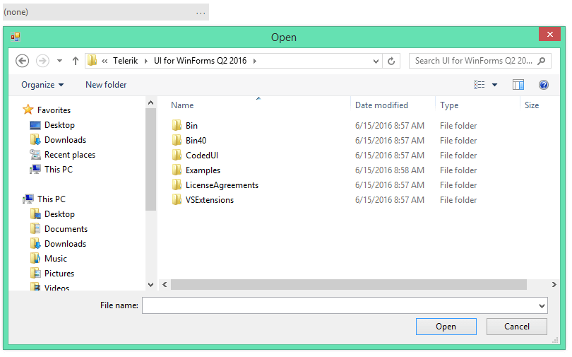
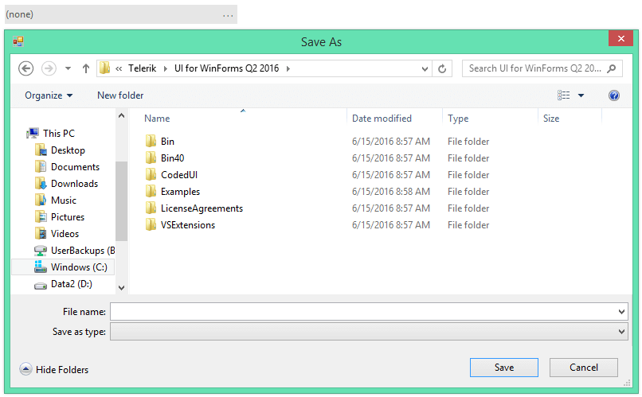
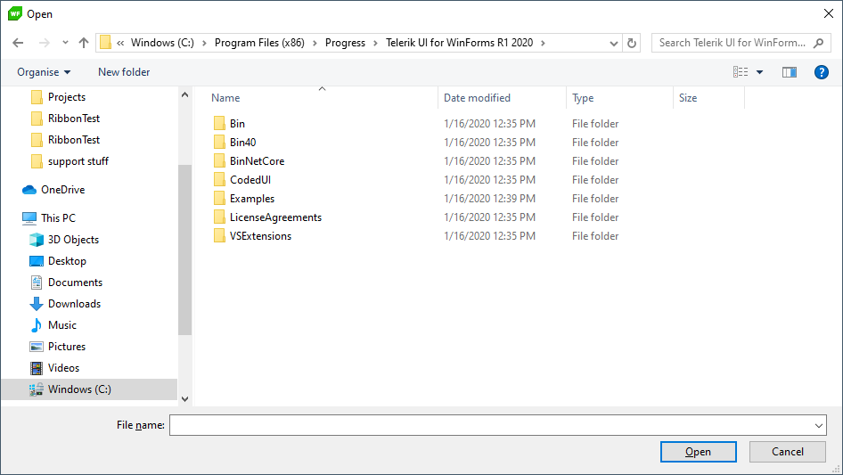
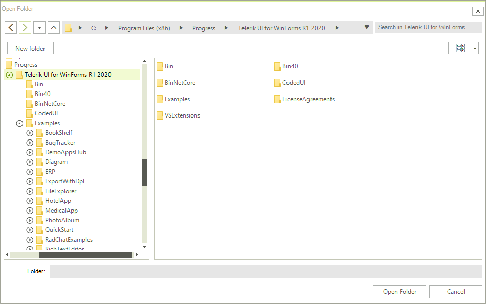
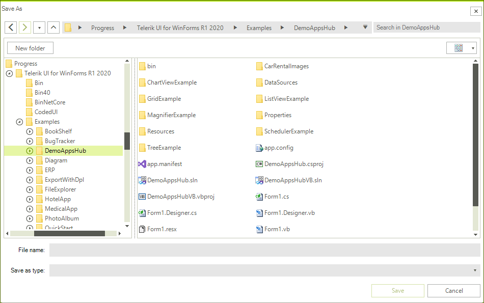

# Dialog Types

__RadBrowseEditor__ comes with a predefined set of dialog types. The available types are determined by the **BrowseEditorDialogType** enumeration and the chosen option can be set to the __DialogType__ property of the control. The available dialog types are listed below:

* **FolderBrowseDialog**
* **SaveFileDialog**
* **FontDialog**

As of **R1 2020 SP1** the Telerik [File Dialogs]() are integrated in **RadBrowseEditor**. Hence, three new dialog types were added to the **BrowseEditorDialogType** enumeration:

* **RadOpenFileDialog**
* **RadOpenFolderDialog**
* **RadSaveFileDialog**

>important The **Dialog** property has been obsolete since **R1 2020 SP1**. Use the **BrowseDialog** property instead and cast it to the actual dialog type to access the respective dialog's properties.

#### FolderBrowseDialog

{{source=..\SamplesCS\Editors\BrowseEditor1.cs region=FolderBrowseDialog}} 
{{source=..\SamplesVB\Editors\BrowseEditor1.vb region=FolderBrowseDialog}}
````C#
this.radBrowseEditor1.DialogType = BrowseEditorDialogType.FolderBrowseDialog;

````
````VB.NET
Me.RadBrowseEditor1.DialogType = BrowseEditorDialogType.FolderBrowseDialog

````


{{endregion}}

>caption Figure 1: FolderBrowseDialog



#### FontDialog

{{source=..\SamplesCS\Editors\BrowseEditor1.cs region=FontDialog}} 
{{source=..\SamplesVB\Editors\BrowseEditor1.vb region=FontDialog}}
````C#
this.radBrowseEditor1.DialogType = BrowseEditorDialogType.FontDialog;

````
````VB.NET
Me.RadBrowseEditor1.DialogType = BrowseEditorDialogType.FontDialog

````


{{endregion}}

>caption Figure 2: FontDialog



#### OpenFileDialog

{{source=..\SamplesCS\Editors\BrowseEditor1.cs region=OpenFileDialog}} 
{{source=..\SamplesVB\Editors\BrowseEditor1.vb region=OpenFileDialog}}
````C#
this.radBrowseEditor1.DialogType = BrowseEditorDialogType.OpenFileDialog;

````
````VB.NET
Me.RadBrowseEditor1.DialogType = BrowseEditorDialogType.OpenFileDialog

````


{{endregion}}

>caption Figure 3: OpenFileDialog



#### SaveFileDialog

{{source=..\SamplesCS\Editors\BrowseEditor1.cs region=SaveFileDialog}} 
{{source=..\SamplesVB\Editors\BrowseEditor1.vb region=SaveFileDialog}}
````C#
this.radBrowseEditor1.DialogType = BrowseEditorDialogType.SaveFileDialog;

````
````VB.NET
Me.RadBrowseEditor1.DialogType = BrowseEditorDialogType.SaveFileDialog

```` 
{{endregion}}

>caption Figure 4: SaveFileDialog




#### RadOpenFileDialog

{{source=..\SamplesCS\Editors\BrowseEditor1.cs region=TelerikOpenFileDialog}} 
{{source=..\SamplesVB\Editors\BrowseEditor1.vb region=TelerikOpenFileDialog}}

````C#
this.radBrowseEditor1.DialogType = BrowseEditorDialogType.RadOpenFileDialog;

````
````VB.NET
Me.RadBrowseEditor1.DialogType = BrowseEditorDialogType.RadOpenFileDialog

```` 
{{endregion}}

>caption Figure 5: RadOpenFileDialog



#### RadOpenFolderDialog

{{source=..\SamplesCS\Editors\BrowseEditor1.cs region=TelerikOpenFolderDialog}} 
{{source=..\SamplesVB\Editors\BrowseEditor1.vb region=TelerikOpenFolderDialog}}

````C#
this.radBrowseEditor1.DialogType = BrowseEditorDialogType.RadOpenFolderDialog;

````
````VB.NET
Me.RadBrowseEditor1.DialogType = BrowseEditorDialogType.RadOpenFolderDialog

```` 
{{endregion}}

>caption Figure 6: RadOpenFolderDialog




#### RadSaveFileDialog


{{source=..\SamplesCS\Editors\BrowseEditor1.cs region=TelerikSaveFileDialog}} 
{{source=..\SamplesVB\Editors\BrowseEditor1.vb region=TelerikSaveFileDialog}}

````C#
 this.radBrowseEditor1.DialogType = BrowseEditorDialogType.RadSaveFileDialog;

````
````VB.NET
Me.RadBrowseEditor1.DialogType = BrowseEditorDialogType.RadSaveFileDialog

```` 
{{endregion}} 

>caption Figure 7: RadSaveFileDialog



## See Also

* [Structure]()
* [Smart Tag]()
* [Working with RadBrowseEditor]()