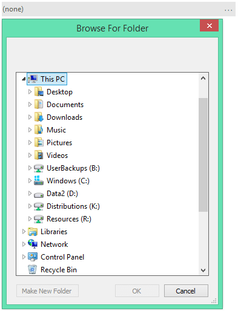
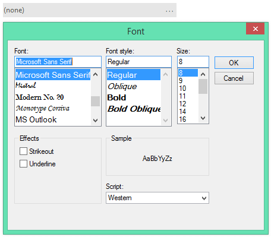
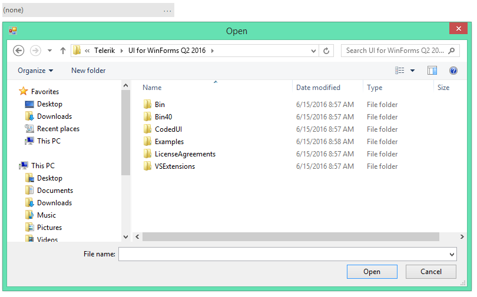
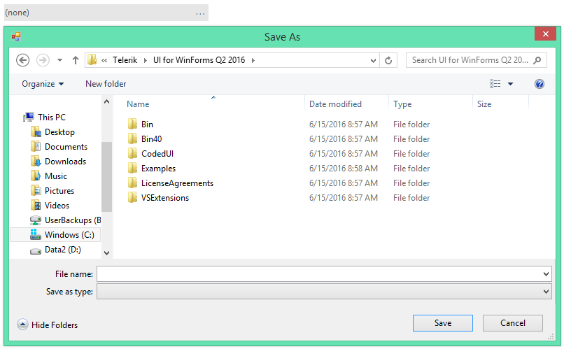
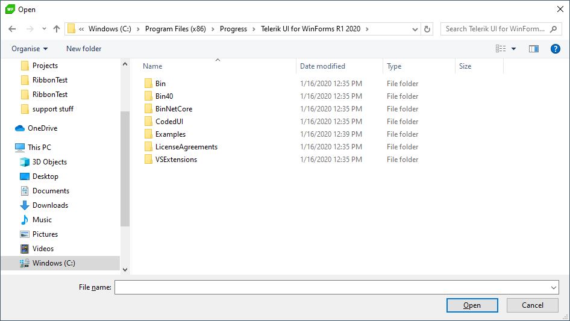
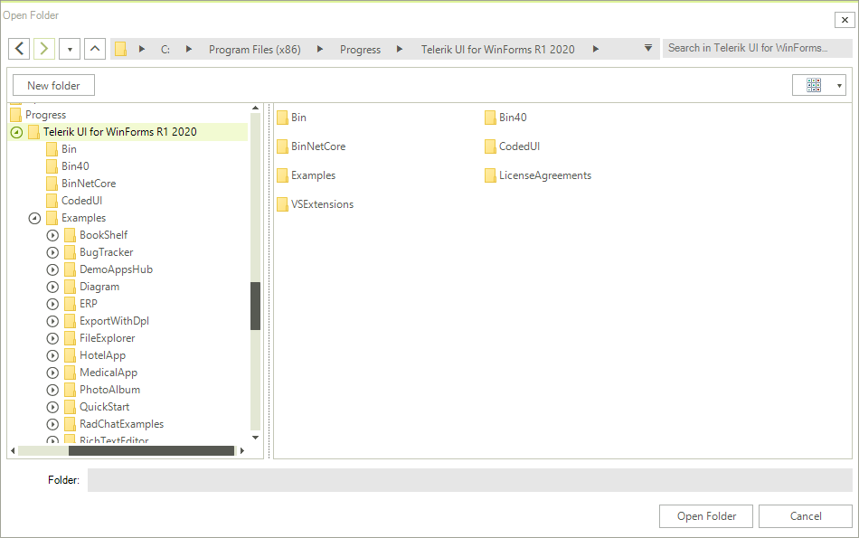
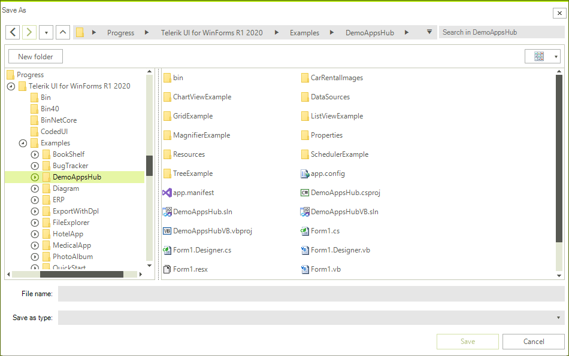

# Dialog Types

__RadBrowseEditor__ comes with a predefined set of dialog types. The available types are determined by the **BrowseEditorDialogType** enumeration and the chosen option can be set to the __DialogType__ property of the control. The available dialog types are listed below:

* **FolderBrowseDialog**
* **SaveFileDialog**
* **FontDialog**

As of **R1 2020 SP1** the Telerik [File Dialogs]() are integrated in **RadBrowseEditor**. Hence, three new dialog types were added to the **BrowseEditorDialogType** enumeration:

* **RadOpenFileDialog**
* **RadOpenFolderDialog**
* **RadSaveFileDialog**

>important The **Dialog** property has been obsolete since **R1 2020 SP1**. Use the **BrowseDialog** property instead and cast it to the actual dialog type to access the respective dialog's properties.

#### FolderBrowseDialog

<snippet id='editors-browseeditor1-folderbrowsedialog-cs' />
<snippet id='editors-browseeditor1-folderbrowsedialog-vb' />

>caption Figure 1: FolderBrowseDialog

#### FontDialog

<snippet id='editors-browseeditor1-fontdialog-cs' />
<snippet id='editors-browseeditor1-fontdialog-vb' />

>caption Figure 2: FontDialog

#### OpenFileDialog

<snippet id='editors-browseeditor1-openfiledialog-cs' />
<snippet id='editors-browseeditor1-openfiledialog-vb' />

>caption Figure 3: OpenFileDialog

#### SaveFileDialog

<snippet id='editors-browseeditor1-savefiledialog-cs' />
<snippet id='editors-browseeditor1-savefiledialog-vb' />

>caption Figure 4: SaveFileDialog

#### RadOpenFileDialog

<snippet id='editors-browseeditor1-telerikopenfiledialog-cs' />
<snippet id='editors-browseeditor1-telerikopenfiledialog-vb' />

>caption Figure 5: RadOpenFileDialog

#### RadOpenFolderDialog

<snippet id='editors-browseeditor1-telerikopenfolderdialog-cs' />
<snippet id='editors-browseeditor1-telerikopenfolderdialog-vb' />

>caption Figure 6: RadOpenFolderDialog

#### RadSaveFileDialog

<snippet id='editors-browseeditor1-teleriksavefiledialog-cs' />
<snippet id='editors-browseeditor1-teleriksavefiledialog-vb' />

>caption Figure 7: RadSaveFileDialog

## See Also

* [Structure]()
* [Smart Tag]()
* [Working with RadBrowseEditor]()
