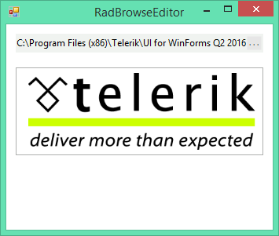

# Getting Started with WinForms BrowseEditor

The following example demonstrates how to change the image of a __RadButton__ using the __RadBrowseEditor__.

>caption Figure 1: Browsed Image



1\. Drag a __RadBrowseEditor__ and a __RadButton__ on a form.

2\. Select the __RadButton__ and in the __Property Window__ set the __DisplayStyle__ to __Image__

3\. Select the __RadBrowseEditor__, click the __Events tab__ of the __Property Window__, locate the __ValueChanged__ event and double-click it in order to create an event handler. Replace the event handler with the following code. 

{{source=..\SamplesCS\Editors\BrowseEditor1.cs region=browseEditorValueChanged}} 
{{source=..\SamplesVB\Editors\BrowseEditor1.vb region=browseEditorValueChanged}} 

````C#
private void radBrowseEditor1_ValueChanged(object sender, EventArgs e)
{
    this.radButton1.Image = Image.FromFile(this.radBrowseEditor1.Value);
}

````
````VB.NET
Private Sub RadBrowseEditor1_ValueChanged(sender As Object, e As EventArgs)
    Me.RadButton1.Image = System.Drawing.Image.FromFile(Me.RadBrowseEditor1.Value)
End Sub

````

{{endregion}} 

4\. Press __F5__ to run the application. Press the browse button and select an image. The image is then applied to the __RadButton__.

## See Also

* [Structure]()
* [Smart Tag]()
* [Dialog Types]()

## Telerik UI for WinForms Learning Resources
* [Telerik UI for WinForms Browseeditor Component](https://www.telerik.com/products/winforms/browseeditor.aspx)
* [Getting Started with Telerik UI for WinForms Components](https://docs.telerik.com/devtools/winforms/getting-started/first-steps)
* [Telerik UI for WinForms Setup](https://docs.telerik.com/devtools/winforms/installation-and-upgrades/installing-on-your-computer)
* [Telerik UI for WinForms Application Modernization](https://docs.telerik.com/devtools/winforms/winforms-converter/overview)
* [Telerik UI for WinForms Visual Studio Templates](https://docs.telerik.com/devtools/winforms/visual-studio-integration/visual-studio-templates)
* [Deploy Telerik UI for WinForms Applications](https://docs.telerik.com/devtools/winforms/deployment-and-distribution/application-deployment)
* [Telerik UI for WinForms Virtual Classroom(Training Courses for Registered Users)](https://learn.telerik.com/learn/course/external/view/elearning/17/telerik-ui-for-winforms)
* [Telerik UI for WinForms License Agreement)](https://www.telerik.com/purchase/license-agreement/winforms-dlw-s)

