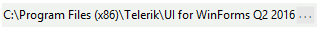

# WinForms BrowseEditor Overview

__RadBrowseEditor__ is a themable control which allows users to select a file or a directory from the file system or directly type the full path to it in the editor.





>caption Figure 1: RadBrowseEditor

The dialog type is determined by the __BrowseEditorDialogType__ enumeration and defined through the __DialogType__ property.

## Telerik UI for WinForms Learning Resources
* [Telerik UI for WinForms BrowseEditor Homepage](https://www.telerik.com/products/winforms/browseeditor.aspx)
* [Get Started with the Telerik UI for WinForms BrowseEditor]()
* [Telerik UI for WinForms API Reference](https://docs.telerik.com/devtools/winforms/api/)
* [Getting Started with Telerik UI for WinForms Components]()
* [Telerik UI for WinForms Virtual Classroom (Training Courses for Registered Users)](https://learn.telerik.com/learn/course/external/view/elearning/17/TelerikUIforWinForms) 
* [Telerik UI for WinForms Forum](https://www.telerik.com/forums/winforms)
* [Telerik UI for WinForms Knowledge Base](https://docs.telerik.com/devtools/winforms/knowledge-base)

## See Also

* [Structure]()
* [Getting Started]()
* [Smart Tag]()
* [Dialog Type]()
