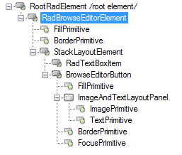
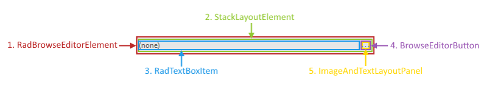

# Structure

This article describes the inner structure and organization of the elements which build the __RadBrowseEditor__ control.

>caption Figure 1: RadBrowseEditor`s Element Hierarchy

>caption Figure 2: RadBrowseEditor`s Structure

1. __RadBrowseEditorElement:__ Represents the main element of __RadBrowseEditor__.
1. __StackLayoutElement:__ Container element responsible for arranging the text box and the button.
1. __RadTextBoxItem:__ Text box handling user input.
1. __BrowseEditorButton:__ Button opening a dialog depending on the value of the __DialogType__ property.
1. __ImageAndTextLayoutPanel:__ Element containing the button`s image and/or text.

## See Also

* [Design Time]()
* [Getting Started]()
