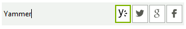

# RadButtonTextBox

**RadButtonTextBox** is a derivative of **RadTextBox** which allows you to embed easily button elements on the left or right side of the text box. It exposes proper design time support to add button elements (and other elements). Once new buttons are added, you will be able to select the elements at design time and work with their properties.





## Key Features

- Left/Right elements collection
- Editable part for handling user's input
- Customizing button elements

## See Also

* [Structure]()
* [Design Time]()
