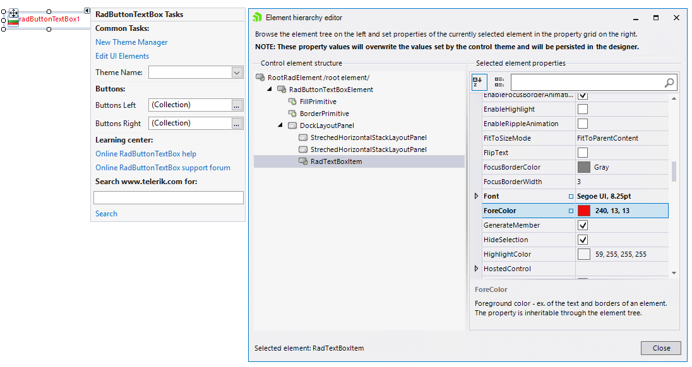
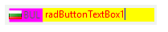

# Accessing and Customizing Elements
 
Accessing and customizing elements can be performed either at design time, or at run time. Before proceeding with this topic, it is recommended to get familiar with the [visual structure]() of **RadButtonTextBox**.
      

## Design time

You can access and modify the style for the different elements in the editable area of **RadButtonTextBox** by using the *Element hierarchy editor*.

>note In order to access the *Element hierarchy editor* select **RadButtonTextBox** and click the small arrow on the top right position in order to open the Smart Tag. Then, click the *Edit UI Elements*.

>caption Figure 1: Element hierarchy editor

## Programmatically

You can customize the nested elements at run time as well:

>caption Figure 2: Customize elements

#### Customize elements 

<snippet id='editors-buttontextbox-customizeelements-cs' />
<snippet id='editors-buttontextbox-customizeelements-vb' />