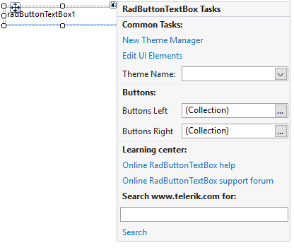
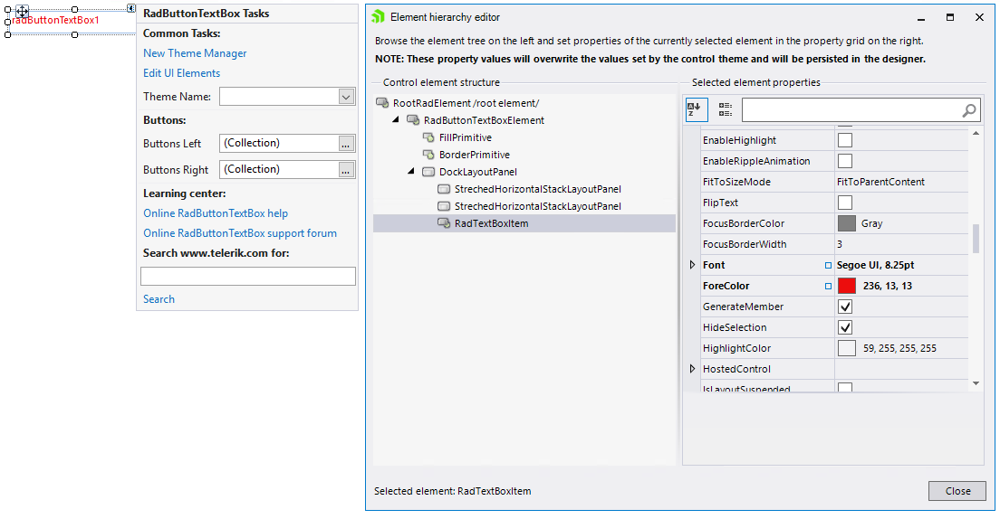

# Design Time

To start using **RadButtonTextBox** just drag it from the toolbox and drop it onto the form.
 
## Smart Tag

Select **RadButtonTextBox** and click the small arrow on the top right position in order to open the __Smart Tag__. The __Smart Tag__ for **RadButtonTextBox** lets you quickly access common tasks involved with building **RadButtonTextBox** elements and customizing appearance through themes.

>caption Figure 1: Smart Tag

* __New Theme Manager__: adds a new __RadThemeManager__ component to the form.
            

* __Edit UI Elements__: allows setting properties at multiple levels of the class hierarchy.
            
    >caption Figure 2: Element hierarchy editor

    

* __Theme Name__: select a theme name from the drop down list of themes available for that control. Selecting a theme allows you to change all aspects of the control's visual style at one time.
            

* **Buttons Left**/**Buttons Right**: allows populating the **RadButtonTextBox** at design time. Additional information can be found in the [Populating with Data >> Design Time]() help article.
            
* __Learning Center:__ Navigate to the Telerik help, code library projects or support forum.
* __Search:__ Search the Telerik site for a given string.

       
# See Also

* [Element Hierarchy Editor]()
* [Using default themes]()