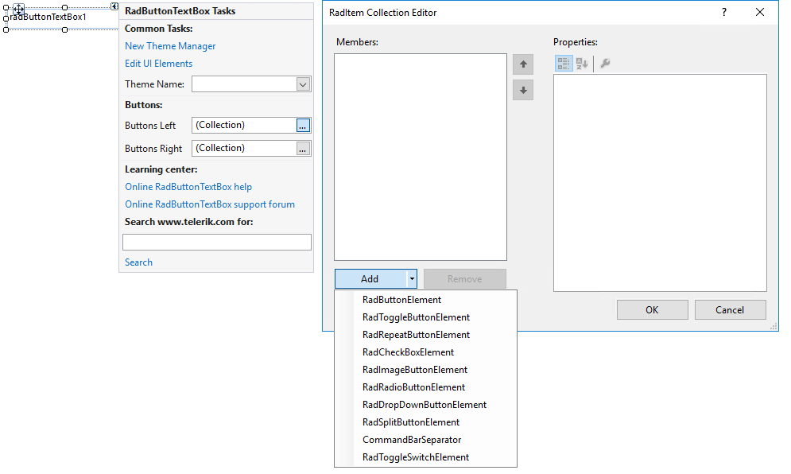
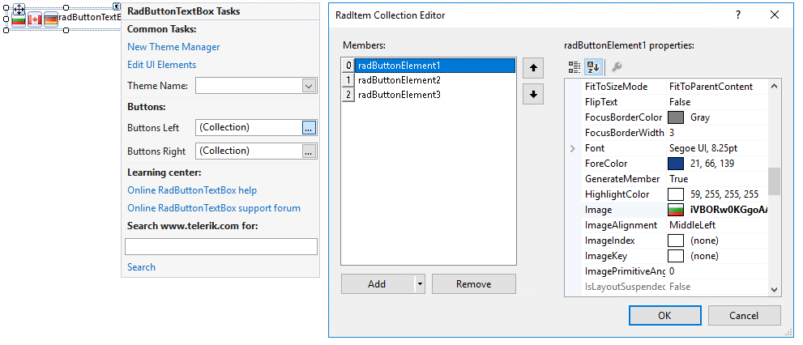
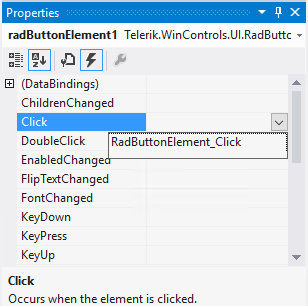

# Getting Started

**RadButtonTextBox** is used to get input from the user or to display text. It exposes left/right **StackLayoutPanels** which host button elements on the left/right side of the text box.
         
The text displayed by the control resides in the __Text__ property. It can be set at design time via the **Properties** window in Visual Studio, at run time in code, or by the user's input at run time. The current contents of a text box can be retrieved at run time by the __Text__ property.

The following tutorial demonstrates how to add buttons with images to a **RadButtonTextBox** and how to handle the clicking of the button elements.

1. Add a **RadButtonTextBox**  to a form.
2. Add three images to the project as resources.
3. Select the **RadButtonTextBox** and click the small arrow on the top right position in order to open the __Smart Tag__. Find the **Buttons Left** property and click the ellipsis button to open the *RadItem Collection Editor*.

	

4.  Click the **Add** button three times to create three **RadButtonElement**s. Clear the text of the first, second and third button elements respectively. Set the resource images to the **Image** property of the items.

	

5. Click **OK** to close the *RadItem Collection Editor*.

6. In the **Properties** Window select the **Events** button.

7. Locate and double-click the RadButtonElement. Click the event to create an event handler.
	
	

You can place any custom code that you wish to be performed when the user clicks the first button element in **RadButtonTextBox**.
