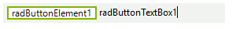
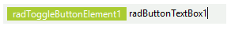
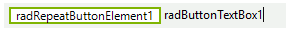
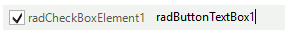
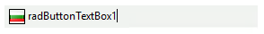
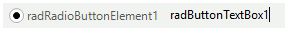
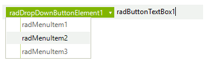
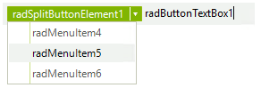
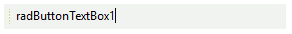

# Item Types

You can add these item types to the **RadButtonTextBox** either at design time via the *RadItem Collection Editor* or at run time programatically. 

|Type|Image
|----|----|
|**RadButtonElement**||
|**RadToggleButtonElement**||
|**RadRepeatButtonElement**||
|**RadCheckBoxElement**||
|**RadImageButtonElement**||
|**RadRadioButtonElement**||
|**RadDropDownButtonElement**||
|**RadSplitButtonElement**||
|**CommandBarSeparator**||
|**RadToggleSwitchElement**||

# See Also

* [Design Time]()
* [Adding Items Programmatically]()
