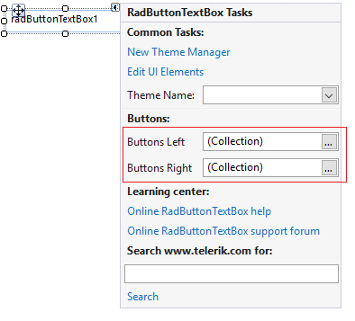

# Design time
 
This article demonstrates how to populate **RadButtonTextBox** with data at design time. The *RadItem Collection Editor* allows you to do that. 

>caption Figure 1: RadItem Collection Editor

You can access it through the *Smart tag >> Buttons Left/Buttons Right* option:

>caption Figure 2: Smart tag options

Another possibility to open the editor is via the **LeftButtonItems** and **RightButtonItems** collections in the *Properties* Visual Studio section:

>caption Figure 3:  Visual Studio Properties window

You can add several item types: **RadButtonElement**, **RadToggleButtonElement**, **RadRepeatButtonElement**, **RadCheckBoxElement**, **RadImageButtonElement**, **RadRadioButtonElement**, **RadDropDownButtonElement**, **RadSplitButtonElement**, **CommandBarSeparator**, **RadToggleSwitchElement**. The *RadItem Collection Editor* allows you to manipulate the respective properties of the element that you have added at design time. Once, the desired button elements are added, you can subscribe to the **Click** event (or any other event) via the *Properties* section in Visual Studio. 

# See Also

* [Adding Items Programmatically]()