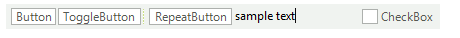

# Adding items programmatically

**RadButtonTextBox** supports adding items at run time, which means that you can manually populate it with data. The following examples demonstrate how to add different button elements to the RadButtonTextBox's **RightButtonItems** and **LeftButtonItems** collections. 

>caption Figure 1: Adding button elements

#### Add button elements programmatically 

<snippet id='editors-buttontextbox-additemsprogrammatically-cs' />
<snippet id='editors-buttontextbox-additemsprogrammatically-vb' />

The following code snippet demonstrates how to add programmatically different types of elements in **RadButtonTextBox**:

>caption Figure 2: Adding Different Elements

#### Add different elements programmatically 

<snippet id='editors-buttontextbox-allitems-cs' />
<snippet id='editors-buttontextbox-allitems-vb' />

# See Also

* [Design Time]()

